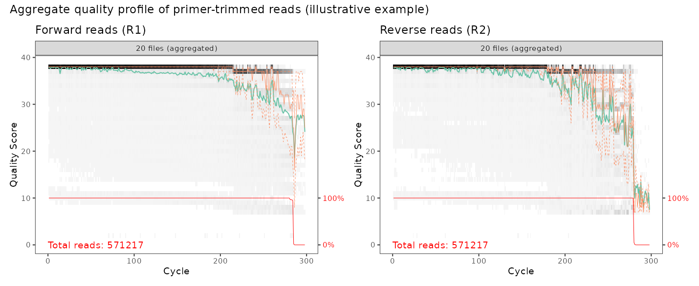
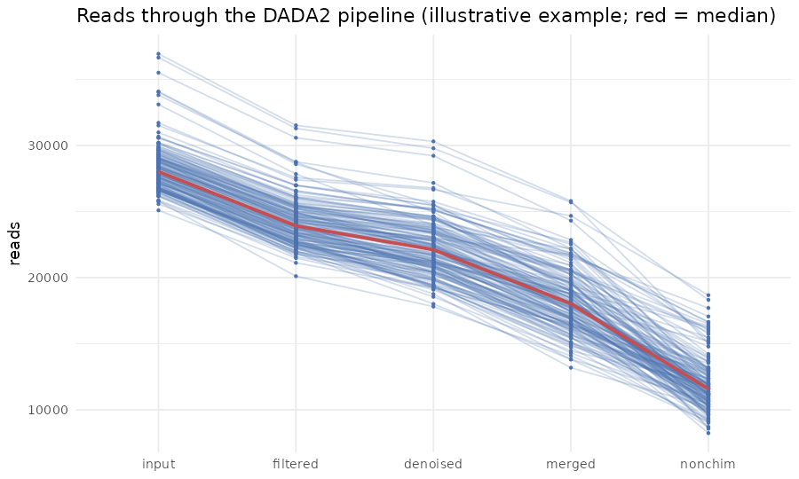
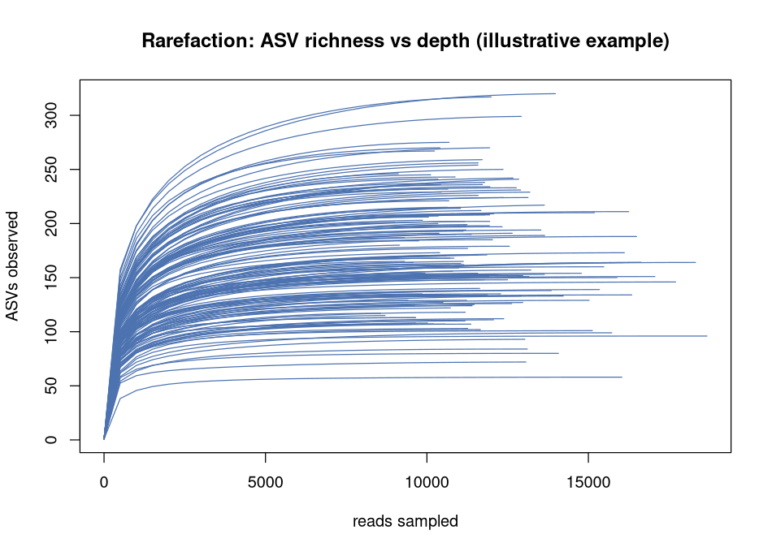

*Taylor Lab | Illumina Short-Read 16S DADA2 SOP*

# **DADA2 Pipeline: Illumina V3–V4 16S to ASV Tables on NeSI**

**v1.0** | last updated August 2026 | NeSI (SLURM) | Illumina paired-end 16S (V3–V4) | suite v1.1 (August 2026)

**Contents:** [Quick Roadmap](#quick-roadmap) · [1. Understanding Your Data](#1-understanding-your-data) · [2. Set Up the Environment](#2-set-up-the-environment) · [3. Remove Primers with cutadapt](#3-remove-primers-with-cutadapt) · [4. Inspect Quality and Choose truncLen](#4-inspect-quality-and-choose-trunclen) · [5. Denoise to ASVs and Assign Taxonomy](#5-denoise-to-asvs-and-assign-taxonomy) · [6. Read-Tracking QC](#6-read-tracking-qc) · [7. Hand Off to R](#7-hand-off-to-r) · [Troubleshooting](#troubleshooting) · [Appendices](#appendices)

This document covers the DADA2 workflow on NeSI for paired-end short-read Illumina 16S — the V3–V4 region, amplified with the 341F/785R primers. It takes raw demultiplexed FASTQs through to a single **amplicon sequence variant (ASV) count table with a taxonomy column for every ASV** (`counts_dada2.tsv`). That table, plus a metadata sheet, is the input to `SOP_R_Analysis.md`, which does the statistics. This is the short-read counterpart of `SOP_EMU_NeSI.md` (Nanopore full-length 16S).

**This is the classic single-run workflow:** one sequencing run, one ASV table. It does **not** merge tables across runs, regions or studies. Pooling short-read 16S across runs has its own traps (different error models, different primer regions) and gives wrong answers silently if done casually, so it is a separate meta-analysis concern kept out of this SOP. Process each run through here on its own.

Paths use `<your_nesi_project_code>` and `<your_project>` placeholders. Substitute your own throughout.

### **Before You Start**

- **You need** a NeSI account and project code (`<your_nesi_project_code>`), your raw demultiplexed paired-end FASTQs (one `_R1_001.fastq.gz` and one `_R2_001.fastq.gz` per sample, all in one directory), a sample metadata sheet, and about half a day of wall-clock across the queue. Replace `<your_nesi_project_code>` and `<your_project>` with your own values throughout.

- **This does not cover** demultiplexing or basecalling (your sequencing provider does that), Nanopore or full-length 16S (that is `SOP_EMU_NeSI.md`), the R statistics (that is `SOP_R_Analysis.md`), or merging several runs into one analysis (a meta-analysis, out of scope here).

- **No prior terminal experience is assumed, but this document does not teach the cluster.** If you have never used bash or SLURM, work through `SOP_EMU_NeSI.md` **Sections 1–2** first: they teach login, bash, modules, SLURM and array jobs, and what a FASTQ file and a quality score are. This SOP points back there rather than repeating it.

---

## **Quick Roadmap**

```
SECTION 2: Set up (once per project)
   modules  ->  install dada2 if missing  ->  download SILVA 138.1
                    |
SECTION 3: Remove primers
   cutadapt on paired reads (341F / 785R)  ->  trimmed/
                    |
SECTION 4: Inspect quality, choose truncLen
   plotQualityProfile  ->  read the profile  ->  pick truncF / truncR
                    |
SECTION 5: Denoise to ASVs + assign taxonomy   (the heavy SLURM job)
   filterAndTrim -> learnErrors -> dada -> mergePairs (R1-only fallback)
   -> removeBimeraDenovo -> assignTaxonomy (SILVA) -> reshape for R
                    |
SECTION 6: Read-tracking QC
   where did reads drop?  healthy vs alarming
                    |
SECTION 7: Hand off to R
   counts_dada2.tsv + metadata  ->  SOP_R_Analysis.md
```

**The one thing to remember:** `truncLen` (Section 4) — how far each read is trimmed — is where this pipeline most often fails silently. Set it too aggressively and `filterAndTrim` throws away every read, or the forward and reverse reads no longer overlap and merging collapses. Read the quality profile before you set it, and check the read-tracking table (Section 6) after.

---

## **1. Understanding Your Data**

Before the commands, some background on what you are sequencing and what DADA2 does with it.

### **Short-read 16S and the V3–V4 amplicon**

Every bacterium and archaeon carries the **16S rRNA gene**, about 1,500 bases long, with nine hypervariable regions (V1–V9) sitting between stretches that barely change across species. Reading a variable region and comparing it to a reference tells you which organisms are present. (For the full 16S background, see `SOP_EMU_NeSI.md` Section 2.)

Illumina short-read sequencing reads only ~250–300 bases from each end of a fragment, so it cannot cover the whole gene. Instead you amplify one window. **Primers** are short DNA sequences that bind either side of a target region and start the copy; the copied stretch between them is the **amplicon**. This SOP uses the V3–V4 window, made with the **341F** primer (forward, `CCTACGGGNGGCWGCAG`) and the **785R** primer (reverse, `GACTACHVGGGTATCTAATCC`). The amplicon they produce is roughly **460 bp** including the primers.

### **Paired-end reads and the overlap problem**

Each fragment is read from both ends: **R1**, the forward read, and **R2**, the reverse read — two FASTQ files per sample. To rebuild the full amplicon you line the two reads up where they overlap in the middle and merge them into one sequence.

This only works if the reads are long enough to reach each other. After the primers are removed, the V3–V4 amplicon is about **420 bp** of biological sequence, so the forward and reverse read lengths must add up to more than that, with a margin to overlap.

**2×300 bp** sequencing overlaps comfortably; **2×250 bp** is tight; **2×150 bp cannot span a V3–V4 amplicon at all**. This one fact drives most of Section 4 and Section 5, so check your read length first:

```bash
zcat raw/<one_sample>_R1_001.fastq.gz | head -2 | tail -1 | wc -c   # ~read length + 1
```

### **What an ASV is, and ASV vs OTU**

An **amplicon sequence variant (ASV)** is an exact, error-corrected sequence — the actual biological sequence DADA2 infers is present, down to the single base. DADA2 models sequencing error and removes it, so two sequences that differ by one nucleotide are resolved as two ASVs rather than blurred together.

The older approach produced **OTUs** (operational taxonomic units): sequences clustered at a similarity threshold, usually 97%, into approximate groups. The difference matters:

| | ASV (this SOP) | OTU (older / CONCOMPRA) |
| --- | --- | --- |
| Definition | Exact denoised sequence | Cluster at a % threshold |
| Resolution | Single-nucleotide | ~97% similarity |
| Reproducible across studies | Yes — same sequence is the same feature everywhere | No — clusters are study-specific |

This SOP produces ASVs. (`SOP_CONCOMPRA_NeSI.md` builds consensus OTUs from Nanopore reads, the long-read counterpart.)

### **How DADA2 denoises: the error model**

Sequencing turns one true sequence into a cloud of near-identical variants. DADA2 first **learns an error model** from your reads — the probability that each base is miscalled as each other base, as a function of its quality score — then uses it to decide, for every candidate sequence, whether it is a real biological variant or an error thrown off a more abundant one.

Two consequences you must respect. The error model is **learned per sequencing run**, because error patterns differ between runs and machines — which is why the processing unit here is a whole run, not a sample. And it needs enough reads to learn from, which is why all of a run's samples are denoised together in one job rather than one sample per array task.

### **Chimeras**

A **chimera** is an artificial hybrid sequence formed during PCR, when a half-finished copy of one organism's amplicon primes and finishes on another organism's template. It is not a real organism, and left in, it inflates your diversity with sequences that never existed.

After denoising and merging, DADA2 removes chimeras (`removeBimeraDenovo`) by finding sequences that can be rebuilt from two more-abundant "parent" sequences. Losing a few per cent of reads here is normal; losing most of them is a red flag — usually leftover primer (see [Troubleshooting](#troubleshooting)).

### **Why DADA2 runs as a batch job, not in RStudio**

`learnErrors` and `dada` are memory-heavy: on a full run they routinely need tens of gigabytes, and this SOP requests **120 GB**. An interactive RStudio session on a login node has a small memory ceiling and will be **killed mid-run** — an "OOM" (out-of-memory) kill — often after an hour of work, with no usable output.

Run the denoising as a submitted SLURM batch job, as in Section 5. Use RStudio only for the light quality-profile plot in Section 4 if you prefer it, and nothing heavier.

---

## **2. Set Up the Environment**

**What this does.** Loads the two modules the pipeline needs, installs the `dada2` R package to your personal library if the module bundle does not already carry it, and downloads the SILVA reference DADA2 uses to name ASVs. Run it once per project.

**Why these modules.** `R-bundle-Bioconductor/3.23-foss-2026-R-4.6.0` gives you R 4.6 with Bioconductor, where `dada2` and `phyloseq` live; `cutadapt/5.2-foss-2023a-Python-3.11.6` does the primer removal in Section 3. Module strings drift — confirm each with `module spider <tool>` (capitalisation included) before you rely on it.

### **Plan your storage first**

This is the one thing you cannot undo later. Keep reference databases and intermediate reads on **nobackup** (large, fast, not backed up, purged on a rolling basis); keep your scripts and final tables on **project** (backed up). If you `rm` something on nobackup, it is gone.

| Path | Holds |
| --- | --- |
| `/nesi/nobackup/<your_nesi_project_code>/<your_project>/raw/` | Your demultiplexed FASTQs (`_R1_001` / `_R2_001`) |
| `/nesi/nobackup/<your_nesi_project_code>/<your_project>/ref/` | SILVA 138.1 reference (~215 MB) |
| `/nesi/nobackup/<your_nesi_project_code>/<your_project>/trimmed/<run>/` | Primer-removed reads (Section 3) |
| `/nesi/nobackup/<your_nesi_project_code>/<your_project>/asv/<run>/` | DADA2 outputs: ASV table, taxonomy, tracking (Section 5) |
| `/nesi/project/<your_nesi_project_code>/...` | Final `counts_dada2.tsv` and scripts (backed up) |

`<run>` is a short name you give this sequencing run (for example `tofi_v3v4`); it keeps one run's outputs separate from another's. The scripts below set it once as a shell variable `RUN`.

### **The setup script**

Save as `02_setup_dada2.sh`. It is light enough to run on a login node; `module purge` first.

```bash
#!/bin/bash
# One-time setup for the DADA2 pipeline: modules, dada2 (install only if missing), SILVA 138.1.
set -euo pipefail

module purge
module load R-bundle-Bioconductor/3.23-foss-2026-R-4.6.0
module load cutadapt/5.2-foss-2023a-Python-3.11.6
echo "cutadapt: $(cutadapt --version)"

# dada2 ships in the Bioconductor bundle on most builds; install to your personal
# library (R_LIBS_USER) only if this build does not carry it.
Rscript -e 'if (!requireNamespace("dada2", quietly=TRUE)) {
  message("dada2 not in bundle -> installing to R_LIBS_USER");
  l <- Sys.getenv("R_LIBS_USER"); dir.create(l, recursive=TRUE, showWarnings=FALSE);
  if (!requireNamespace("BiocManager", quietly=TRUE))
    install.packages("BiocManager", repos="https://cloud.r-project.org", lib=l);
  BiocManager::install("dada2", lib=l, update=FALSE, ask=FALSE)
}; suppressMessages(library(dada2)); cat("dada2", as.character(packageVersion("dada2")), "ready\n")'

# SILVA 138.1, DADA2-formatted (Zenodo record 4587955): train set + species assignment.
REF=/nesi/nobackup/<your_nesi_project_code>/<your_project>/ref
mkdir -p "$REF"
get() { [ -s "$REF/$2" ] && { echo "have $2"; return; }; echo "downloading $2 ...";
        wget -q -O "$REF/$2" "$1" || echo "  FAILED $2 (verify the URL)"; }
get https://zenodo.org/records/4587955/files/silva_nr99_v138.1_train_set.fa.gz    silva_nr99_v138.1_train_set.fa.gz
get https://zenodo.org/records/4587955/files/silva_species_assignment_v138.1.fa.gz silva_species_assignment_v138.1.fa.gz
echo "setup done -> $REF"
```

Run it with `bash 02_setup_dada2.sh`.

**Why SILVA 138.1 (not 138.2).** The suite standardises on the validated v138.1 DADA2 build so short-read taxonomy is comparable with the Nanopore Emu work, which uses the same release. `SOP_EMU_NeSI.md` and the README explain the 138.1-vs-138.2 choice.

**How long.** Modules load in seconds. The `dada2` install, only if it is missing, takes 10–20 minutes. The two SILVA files (~215 MB total) download in a few minutes.

**Checkpoint.**

```bash
REF=/nesi/nobackup/<your_nesi_project_code>/<your_project>/ref
ls -lh "$REF"/silva_nr99_v138.1_train_set.fa.gz "$REF"/silva_species_assignment_v138.1.fa.gz
module load R-bundle-Bioconductor/3.23-foss-2026-R-4.6.0
Rscript -e 'suppressMessages(library(dada2)); cat("dada2", as.character(packageVersion("dada2")), "OK\n")'
```

> **Expect** both files present (~131 MB and ~75 MB, as `ls -lh` prints them) and a `dada2 <version> OK` line. A **zero-byte** SILVA file means the download failed — re-run and check the URL. An **error** instead of the `OK` line means `dada2` did not install; read the install output above it.

---

## **3. Remove Primers with cutadapt**

**What this does.** Strips the 341F and 785R primer sequences from the 5' end of every R1 and R2 read, and discards any pair where the primer was not found. This is **mandatory before DADA2** — DADA2 assumes primer-free input.

**Why remove primers, and why `--discard-untrimmed`.** Primer bases are not biological sequence. Worse, these primers contain ambiguous bases (`N`, `W`, `H`, `V`) that are not real variation; left in, DADA2 treats them as signal, which corrupts the error model and inflates chimeras. A genuine V3–V4 read begins with the primer, so a read *without* it is off-target (mispriming, adapter dimer) and `--discard-untrimmed` drops it.

Save as `03_cutadapt.sh`. Create `logs/` first: `mkdir -p /nesi/nobackup/<your_nesi_project_code>/<your_project>/logs`.

```bash
#!/bin/bash
#SBATCH --account <your_nesi_project_code>
#SBATCH --job-name cutadapt_<your_project>
#SBATCH --chdir /nesi/nobackup/<your_nesi_project_code>/<your_project>
#SBATCH --time 01:00:00
#SBATCH --mem 8G
#SBATCH --cpus-per-task 8
#SBATCH --output logs/%x_%j.out
#SBATCH --error logs/%x_%j.err

set -euo pipefail

module purge
module load cutadapt/5.2-foss-2023a-Python-3.11.6

RUN=tofi_v3v4                       # a short name for this sequencing run
FWD=CCTACGGGNGGCWGCAG              # 341F (forward primer)
REV=GACTACHVGGGTATCTAATCC          # 785R (reverse primer)
RAW=raw
TRIM=trimmed/$RUN
mkdir -p "$TRIM"

for r1 in "$RAW"/*_R1_001.fastq.gz; do
    [ -e "$r1" ] || continue
    r2="${r1/_R1_001/_R2_001}"
    b=$(basename "$r1" _R1_001.fastq.gz)
    cutadapt -g "$FWD" -G "$REV" --discard-untrimmed \
        -j "$SLURM_CPUS_PER_TASK" \
        -o "$TRIM/${b}_R1_001.fastq.gz" \
        -p "$TRIM/${b}_R2_001.fastq.gz" \
        "$r1" "$r2" >> "logs/cutadapt_${RUN}.log"
done

echo "$RUN" > runs.txt              # one line per independent run (here, one)
echo "cutadapt done -> $TRIM"
```

Submit with `sbatch 03_cutadapt.sh`. `-g` removes the forward primer from R1, `-G` the reverse primer from R2.

**If cutadapt keeps almost no reads, your reads were already primer-trimmed.** Some providers deliver primer-removed FASTQs. If the log shows ~0% reads passing across every sample, do not force it — use the raw reads as-is by pointing `trimmed/$RUN/` at them:

```bash
RUN=tofi_v3v4
rm -f trimmed/$RUN/*.fastq.gz
for r1 in raw/*_R1_001.fastq.gz; do
    r2="${r1/_R1_001/_R2_001}"
    ln -s "$(realpath "$r1")" "trimmed/$RUN/$(basename "$r1")"
    ln -s "$(realpath "$r2")" "trimmed/$RUN/$(basename "$r2")"
done
```

A near-zero result with *primers present* in the reads instead means the primer sequence or orientation is wrong — check them against your library prep before continuing.

**How long.** A few minutes to ~30 minutes for ~200 samples on 8 CPUs.

**Checkpoint.**

```bash
RUN=tofi_v3v4
ls -1 trimmed/$RUN/*_R1_001.fastq.gz | wc -l                       # == your sample count
echo "reads kept: $(( $(zcat trimmed/$RUN/*_R1_001.fastq.gz | wc -l) / 4 ))"
```

> **Expect** one trimmed R1 file per input sample, and the large majority of reads kept (typically **>80%** for on-target V3–V4). **Near-zero** kept means the reads were already primer-trimmed (use the fallback above) or the primers are wrong. A drop **in only some samples** means those are low-quality or off-target — note them and carry on.

---

## **4. Inspect Quality and Choose truncLen**

This is the decision the whole run turns on, so it gets its own step. `truncLen` is where you cut each read: you trim off the low-quality tail — Illumina reads degrade toward the 3' end, and R2 degrades faster than R1 — so DADA2's error model is not swamped by junk. But you must leave the forward and reverse reads **long enough to still overlap and merge**.

### **The rule that sets the floor**

After primer removal the V3–V4 amplicon is about **420 bp**, and merging needs the two reads to overlap by at least ~12 bp. So:

```
truncF + truncR  >=  ~420 (insert)  +  ~12 (minimum overlap)  ~=  435
```

Aim comfortably above that — **≥ ~460** — so a merge is not living on the edge. What that means per read length:

| Sequencing | Typical truncF / truncR | Overlap left | Verdict |
| --- | --- | --- | --- |
| 2×300 bp | 280 / 220 | ~80 bp | Comfortable — the default |
| 2×250 bp | 240 / 210 | ~30 bp | Tight — trim as little as quality allows; watch the merge fraction |
| 2×150 bp | 150 / 150 | none | Cannot merge V3–V4 → forward-reads-only (Section 5) |

If your reads are 2×150, you will not merge a V3–V4 amplicon no matter what `truncLen` you pick; the Section 5 script detects this and falls back to forward-reads-only ASVs. Expect it, rather than fighting it.

### **Plot the quality profile**

Save `04_quality_profile.R`:

```r
#!/usr/bin/env Rscript
# Aggregate quality profiles of primer-trimmed reads, to choose truncLen (Section 4).
suppressMessages(library(dada2))
a <- commandArgs(trailingOnly = TRUE); reads <- a[1]; out <- a[2]
fnF <- sort(list.files(reads, pattern = "_R1_001\\.fastq\\.gz$", full.names = TRUE))
fnR <- sort(list.files(reads, pattern = "_R2_001\\.fastq\\.gz$", full.names = TRUE))
n <- min(12, length(fnF))                    # aggregate over up to 12 samples
ggplot2::ggsave(file.path(out, "qualityF.pdf"),
                plotQualityProfile(fnF[seq_len(n)], aggregate = TRUE), width = 7, height = 5)
ggplot2::ggsave(file.path(out, "qualityR.pdf"),
                plotQualityProfile(fnR[seq_len(n)], aggregate = TRUE), width = 7, height = 5)
cat("wrote qualityF.pdf and qualityR.pdf to", out, "\n")
```

Save `04_quality_profile.sh`:

```bash
#!/bin/bash
#SBATCH --account <your_nesi_project_code>
#SBATCH --job-name qprofile_<your_project>
#SBATCH --chdir /nesi/nobackup/<your_nesi_project_code>/<your_project>
#SBATCH --time 00:30:00
#SBATCH --mem 8G
#SBATCH --cpus-per-task 2
#SBATCH --output logs/%x_%j.out
#SBATCH --error logs/%x_%j.err

set -euo pipefail

module purge
module load R-bundle-Bioconductor/3.23-foss-2026-R-4.6.0

RUN=tofi_v3v4
mkdir -p asv/$RUN
Rscript 04_quality_profile.R trimmed/$RUN asv/$RUN
```

Submit with `sbatch 04_quality_profile.sh`, then open `asv/$RUN/qualityF.pdf` and `qualityR.pdf`.

### **Read the profile and choose truncLen**

`plotQualityProfile` draws quality score (y) against read position (x), aggregated over your samples; the **green line is the median**, the dashed orange lines the quartiles. You read one number off each plot — the cycle where the median starts dropping below about **Q30** — and cut just before the quality falls apart.

The worked example's forward and reverse profiles show the call (illustrative — your own curves will differ; see [`examples/dada2/README.md`](examples/dada2/README.md)):



Read the two panels together. The **forward reads (R1, left)** hold a median above Q30 to about cycle 280, so `truncF = 280` keeps almost the whole read. The **reverse reads (R2, right)** degrade sooner and faster — the median is sliding by cycle 200 and drops toward Q25 past 250 — so `truncR = 220` stops before that decline.

That the reverse read falls off first is normal for Illumina paired-end sequencing, and it is the whole reason `truncR` is the shorter cut. The two still sum to 500 — comfortably above the ~460 bp floor — so the trimmed reads keep enough overlap to merge.

**The self-tuning cap — you cannot truncate above your read length.** A value larger than the actual read length makes `filterAndTrim` silently return **zero** reads. The Section 5 script protects you: it caps whatever you choose at the actual post-primer read length (the 2nd percentile, so a few short reads cannot drag it down). You set the *upper bound* from the plot; the script stops it exceeding the data you have.

**How long.** A few minutes.

**Checkpoint.**

```bash
RUN=tofi_v3v4
ls -lh asv/$RUN/qualityF.pdf asv/$RUN/qualityR.pdf
```

> **Expect** both PDFs present and non-zero, showing quality against read position with R2 dropping off before R1. A **missing or zero-byte** PDF means the job failed — read `logs/qprofile_*.err` (usually a wrong module string). Write your chosen `truncF` and `truncR` down for Section 5. If the curves are already low across the whole read, the run is low quality — expect heavier losses at `filterAndTrim` and a lower merge rate.

---

## **5. Denoise to ASVs and Assign Taxonomy**

This one job runs the DADA2 core and writes the R-ready tables. It is the heavy step: **120 GB, 6 CPUs, 8 hours**. It runs as a SLURM **array job with one task per sequencing run** — the error model is learned per run (Section 1), so a whole run is the unit and a single run is a single task. Set the range at submission (`--array=1` for one run).

### **The R pipeline**

Save as `05_dada2.R`. Each stage is labelled `5a`–`5g` and explained after the script.

```r
#!/usr/bin/env Rscript
# DADA2 single-run ASV inference + SILVA taxonomy for paired-end Illumina V3-V4 16S.
# Primer-trimmed reads expected (Section 3). One whole sequencing run per invocation.
# Usage: 05_dada2.R <run> <trimmed_dir> <out_dir> <ref_dir> <truncF> <truncR> <threads>
suppressMessages({ library(dada2); library(ShortRead) })

a   <- commandArgs(trailingOnly = TRUE)
run <- a[1]; reads <- a[2]; out <- a[3]; ref <- a[4]
tF  <- as.integer(a[5]); tR <- as.integer(a[6])
nthreads <- if (length(a) >= 7) as.integer(a[7]) else 4   # from the job's --cpus-per-task; fewer -> lower peak memory
dir.create(file.path(out, "filtered"), recursive = TRUE, showWarnings = FALSE)

silva   <- file.path(ref, "silva_nr99_v138.1_train_set.fa.gz")
silvasp <- file.path(ref, "silva_species_assignment_v138.1.fa.gz")
stopifnot(file.exists(silva), file.exists(silvasp))

# locate paired FASTQs (standard Illumina bcl2fastq naming)
fnF <- sort(list.files(reads, pattern = "_R1_001\\.fastq\\.gz$", full.names = TRUE))
fnR <- sort(list.files(reads, pattern = "_R2_001\\.fastq\\.gz$", full.names = TRUE))
stopifnot(length(fnF) > 0, length(fnF) == length(fnR))
# sample name: drop the Illumina suffix. Adjust these two subs for your naming.
sn  <- sub("_R1_001\\.fastq\\.gz$", "", basename(fnF))   # e.g. AB41273_S72_L001
sn  <- sub("_S[0-9]+_L[0-9]+$",     "", sn)               # e.g. AB41273
filtF <- file.path(out, "filtered", paste0(sn, "_F.fq.gz"))
filtR <- file.path(out, "filtered", paste0(sn, "_R.fq.gz"))

# self-tuning truncLen cap: never truncate above the actual post-primer read
# length (2nd percentile), which would silently drop ALL reads at filterAndTrim.
sw <- function(files) { w <- integer(0)
  for (f in files[seq_len(min(6, length(files)))]) {
    fq <- tryCatch(readFastq(f), error = function(e) NULL)
    if (!is.null(fq) && length(fq) > 0) w <- c(w, width(fq)) }
  w }
wf <- sw(fnF); wr <- sw(fnR)
capF <- if (length(wf)) floor(quantile(wf, 0.02, na.rm = TRUE)) else tF
capR <- if (length(wr)) floor(quantile(wr, 0.02, na.rm = TRUE)) else tR
tF <- if (tF > 0) min(tF, capF) else capF
tR <- if (tR > 0) min(tR, capR) else capR
message(sprintf("[%s] truncLen used %s/%s (read 2%%ile cap %s/%s)", run, tF, tR, capF, capR))

# 5a. quality filter + truncation. multithread = nthreads (the job's CPU count),
# NOT TRUE: on a shared node TRUE grabs every core and can OOM a many-sample run.
flt <- filterAndTrim(fnF, filtF, fnR, filtR, truncLen = c(tF, tR),
                     maxEE = c(2, 2), truncQ = 2, maxN = 0, rm.phix = TRUE,
                     compress = TRUE, multithread = nthreads)
keep  <- file.exists(filtF)                    # drop samples with 0 reads passing
filtF <- filtF[keep]; filtR <- filtR[keep]; sn <- sn[keep]
if (length(filtF) == 0)
  stop(sprintf("[%s] NO reads survived filterAndTrim -- truncLen %d/%d likely exceeds the post-primer read length. Lower truncLen (Section 4).", run, tF, tR))

# 5b. learn the per-run error model; 5c. denoise to ASVs
errF <- learnErrors(filtF, multithread = nthreads)
errR <- learnErrors(filtR, multithread = nthreads)
ddF  <- dada(filtF, err = errF, multithread = nthreads)
ddR  <- dada(filtR, err = errR, multithread = nthreads)
# a single surviving sample makes dada()/mergePairs() return bare objects, not
# lists; wrap into 1-element lists so the per-sample steps below still work.
if (length(filtF) == 1L) { ddF <- setNames(list(ddF), sn); ddR <- setNames(list(ddR), sn) }

# 5d. merge pairs, with FORWARD-READS-ONLY fallback on insufficient overlap.
# Use the merged FRACTION of denoised reads (not merged>0): a handful of
# spuriously-merged non-overlapping reads must not keep a near-empty merged
# table over the far larger R1-only set.
mg <- tryCatch(mergePairs(ddF, filtF, ddR, filtR, verbose = TRUE),
               error = function(e) { message("mergePairs failed: ", conditionMessage(e)); NULL })
if (length(filtF) == 1L && is.data.frame(mg)) mg <- setNames(list(mg), sn)   # 1 sample -> bare data.frame
total_merged <- if (!is.null(mg)) sum(unlist(lapply(mg, function(x) sum(x$abundance))), na.rm = TRUE) else 0
total_denoF  <- sum(sapply(ddF, function(x) sum(getUniques(x))), na.rm = TRUE)
merged_frac  <- if (total_denoF > 0) total_merged / total_denoF else 0
message(sprintf("[%s] merged fraction = %.3f (%.0f merged / %.0f denoisedF)", run, merged_frac, total_merged, total_denoF))
if (!is.null(mg) && merged_frac >= 0.20) {
  st <- makeSequenceTable(mg); mode <- "merged"
} else {
  message(sprintf("[%s] insufficient overlap (%.1f%% merged) -> FORWARD-READS-ONLY ASVs", run, 100 * merged_frac))
  st <- makeSequenceTable(ddF); mode <- "R1only"
}

# 5e. remove chimeras
stnc <- removeBimeraDenovo(st, method = "consensus", multithread = nthreads)
message(sprintf("[%s] %d ASVs after chimera removal (%.1f%% of reads kept)", run, ncol(stnc), 100 * sum(stnc) / sum(st)))

# 5f. assign taxonomy (SILVA 138.1). tryRC matches ASVs regardless of strand.
taxa <- assignTaxonomy(stnc, silva, multithread = nthreads, tryRC = TRUE)
taxa <- addSpecies(taxa, silvasp)

# 5g. reshape to the SOP_R_Analysis.md Section 3 contract
asv_ids <- sprintf("ASV%04d", seq_len(ncol(stnc)))
seqs    <- colnames(stnc)
counts  <- t(stnc); rownames(counts) <- asv_ids; colnames(counts) <- sn   # ASVs x samples, integer
tx <- as.data.frame(taxa, stringsAsFactors = FALSE)[, c("Kingdom","Phylum","Class","Order","Family","Genus","Species")]
colnames(tx) <- c("superkingdom","phylum","class","order","family","genus","species")   # R-analysis rank names
tx <- tx[, c("species","genus","family","order","class","phylum","superkingdom")]        # R-analysis column order
rownames(tx) <- asv_ids

# outputs
saveRDS(stnc, file.path(out, paste0(run, "_seqtab_nochim.rds")))
writeLines(mode, file.path(out, paste0(run, "_mode.txt")))
writeLines(paste0(">", asv_ids, "\n", seqs), file.path(out, paste0(run, "_asv.fasta")))   # keep: IDs map to sequences here
gN <- function(x) sum(getUniques(x))
mergedN <- if (mode == "merged") sapply(mg, gN) else NA
track <- cbind(flt[keep, , drop = FALSE], denoisedF = sapply(ddF, gN), merged = mergedN, nonchim = rowSums(stnc))
rownames(track) <- sn
write.table(track, file.path(out, paste0(run, "_track.tsv")), sep = "\t", quote = FALSE, col.names = NA)
write.table(data.frame(tax_id = asv_ids, tx, check.names = FALSE),
            file.path(out, paste0(run, "_taxonomy.tsv")), sep = "\t", quote = FALSE, row.names = FALSE)
# the R-ready table: tax_id | species..superkingdom | sample1..sampleN
write.table(data.frame(tax_id = asv_ids, tx, counts[asv_ids, , drop = FALSE], check.names = FALSE),
            file.path(out, "counts_dada2.tsv"), sep = "\t", quote = FALSE, row.names = FALSE)
cat(sprintf("[%s] DONE  mode=%s  samples=%d  ASVs=%d  median_reads=%.0f\n",
            run, mode, nrow(stnc), ncol(stnc), median(rowSums(stnc))))
```

### **The SLURM wrapper**

Save as `05_dada2.sh`. Set `TRUNC_F` and `TRUNC_R` to the values you chose in Section 4.

```bash
#!/bin/bash
#SBATCH --account <your_nesi_project_code>
#SBATCH --job-name dada2_<your_project>
#SBATCH --chdir /nesi/nobackup/<your_nesi_project_code>/<your_project>
#SBATCH --time 08:00:00
#SBATCH --mem 120G
#SBATCH --cpus-per-task 6
# No --array line here on purpose -- set the real range at submission (below):
#     sbatch --array=1-$(wc -l < runs.txt)%4 05_dada2.sh     (for one run, --array=1)
#SBATCH --output logs/%x_%A_%a.out
#SBATCH --error logs/%x_%A_%a.err

set -euo pipefail

module purge
module load R-bundle-Bioconductor/3.23-foss-2026-R-4.6.0

TRUNC_F=280        # from Section 4 (2x300 default)
TRUNC_R=220        # from Section 4
REF=/nesi/nobackup/<your_nesi_project_code>/<your_project>/ref

RUN=$(sed -n "${SLURM_ARRAY_TASK_ID}p" runs.txt)
[ -z "$RUN" ] && { echo "no run at array index ${SLURM_ARRAY_TASK_ID}"; exit 1; }
OUT=asv/$RUN
mkdir -p "$OUT"

echo "=== DADA2 $RUN (truncLen ${TRUNC_F}/${TRUNC_R}) $(date) ==="
Rscript 05_dada2.R "$RUN" "trimmed/$RUN" "$OUT" "$REF" "$TRUNC_F" "$TRUNC_R" "${SLURM_CPUS_PER_TASK}"
echo "=== done $RUN $(date) ==="
```

**Submit, setting the array range now.** For one run this is `--array=1`; the general form works for several independent runs (each stays its own table):

```bash
sbatch --array=1-$(wc -l < runs.txt)%4 05_dada2.sh
squeue -u $USER
```

We leave `--array` out of the header on purpose. A hard-coded `#SBATCH --array 1-1` is a trap: submit without overriding it and only the first run is processed, with no error. With no `--array` line, a forgotten range fails loudly instead (`$SLURM_ARRAY_TASK_ID` is unset under `set -u`).

### **What each stage does, and why**

- **5a — `filterAndTrim`.** Cuts reads at `truncLen` and drops the worst. `maxEE=c(2,2)` allows at most ~2 expected errors per read — a quality filter that tolerates a few poor bases but rejects junk, and the DADA2-recommended default. `truncQ=2` also cuts at the first very-low-quality base; `maxN=0` drops reads with any ambiguous `N` (DADA2 cannot use them); `rm.phix=TRUE` removes **PhiX**, a control genome Illumina spikes into runs for calibration that would otherwise appear as spurious reads.

- **5b — `learnErrors`.** Learns the per-run error model (Section 1). This is the memory peak; it is why the job requests 120 GB and runs in batch, not RStudio.

- **5c — `dada`.** Applies the error model to infer the true ASVs, forward and reverse separately.

- **5d — `mergePairs`, with the forward-only fallback — the single most important V3–V4 step.** It stitches each R1 and R2 together on their overlap. **If fewer than 20% of denoised reads merge**, the reads did not overlap (too-short reads, or `truncLen` set too aggressively) and the script falls back to **forward-reads-only** ASVs rather than keep a near-empty merged table.

> **Why the *fraction*, not "any merged reads"?** A handful of spuriously-merged non-overlapping reads would otherwise keep an almost-empty merged table in preference to the far larger R1-only set. Forward-reads-only loses the resolution the reverse read adds but keeps the data usable — the run's `_mode.txt` records which path ran, so **note it in your methods**.

- **5e — `removeBimeraDenovo`.** Removes chimeras (Section 1) by consensus across samples. Expect a few to ~20% of *reads* removed, and often many more low-abundance *sequences*; losing most of your reads here points to leftover primer.

- **5f — `assignTaxonomy` + `addSpecies`.** `assignTaxonomy` classifies each ASV down to genus against SILVA 138.1 (a naive-Bayes classifier; `tryRC=TRUE` so it matches whichever strand the ASV is on). `addSpecies` adds a species name only where an ASV matches a reference sequence exactly.

- **5g — reshape.** Assigns readable ASV IDs (`ASV0001`…), writes the ASV sequences to a FASTA (the IDs are only meaningful alongside it), renames the ranks to the R analysis's names (`Kingdom` → `superkingdom`, all lowercase), and writes `counts_dada2.tsv` in the exact shape `SOP_R_Analysis.md` Section 3 loads. It also writes `<run>_taxonomy.tsv`, a standalone taxonomy-only table (same ASV IDs) for convenience — the R analysis reads `counts_dada2.tsv`, not this.

**How long.** For ~200 samples, `learnErrors` and `dada` dominate — a few hours; `assignTaxonomy` adds 30–60 minutes. The 8-hour header leaves headroom.

**Checkpoint.**

```bash
RUN=tofi_v3v4
ls -1 asv/$RUN/${RUN}_seqtab_nochim.rds asv/$RUN/${RUN}_track.tsv asv/$RUN/${RUN}_asv.fasta asv/$RUN/${RUN}_taxonomy.tsv asv/$RUN/counts_dada2.tsv
cat asv/$RUN/${RUN}_mode.txt                    # "merged" (good) or "R1only" (overlap failed)
grep -c "^>" asv/$RUN/${RUN}_asv.fasta          # number of ASVs
```

> **Expect** all five files present, `mode` = **`merged`** for 2×300 V3–V4, and a few hundred to a few thousand ASVs. `mode` = **`R1only`** means the merge failed — read Section 6 before trusting the table. **Zero** ASVs, or a job that died at `filterAndTrim`, means `truncLen` was too high — lower it (Section 4) and re-run.

---

## **6. Read-Tracking QC**

The standard DADA2 checkpoint is to follow reads through every step and see where they drop. `05_dada2.R` writes this as `<run>_track.tsv` — one row per sample, columns **input → filtered → denoisedF → merged → nonchim**. Print yours:

```bash
RUN=tofi_v3v4
column -t asv/$RUN/${RUN}_track.tsv | head -20
```

Each row is one sample's read count at each stage. Plotted, those rows should look like the worked example below — every line sloping *gently* down, most reads kept at each step, no single cliff (the red line is the median across its 157 samples):



Read your own numbers against this shape. **A steep drop at one transition is the diagnosis:** the column where the reads fall away names the step that went wrong, and the table below turns each drop into a cause.

| Transition | Healthy | Alarming → likely cause |
| --- | --- | --- |
| input → filtered | keep ~70–90% | <50% → `truncLen` too high, or a poor-quality run |
| filtered → denoisedF | keep ~90%+ | large drop → very few reads, or very low complexity |
| denoisedF → merged | keep ~70–90% | <20% → reads did not overlap; the script fell back to R1-only (`merged` column is `NA`) |
| merged → nonchim | keep ~80–95% | <50% → leftover primer inflating chimeras; redo Section 3 |

Then ask whether each sample was sequenced deep enough. A **rarefaction curve** turns a sample's ASV table into a line — ASVs observed as you subsample its reads — and its shape answers the question directly:



Where a curve **flattens**, deeper sequencing would find little new, so that sample's richness is trustworthy. A curve **still climbing** at its right-hand end is under-sequenced — its ASV count is an undercount, and comparing it head-to-head with the deeper, flattened samples reads as a diversity difference that is really only a depth difference.

A common working floor is a few thousand reads per sample; the R analysis's SRS step makes the exact cut-off, but flag or drop the obvious outliers now.

```bash
# median reads out, and the five lowest samples
awk -F'\t' 'NR>1{print $NF}' asv/$RUN/${RUN}_track.tsv | sort -n | awk '{a[NR]=$1} END{print "median reads out:", (NR%2? a[(NR+1)/2] : (a[NR/2]+a[NR/2+1])/2)}'
awk -F'\t' 'NR>1{print $NF"\t"$1}' asv/$RUN/${RUN}_track.tsv | sort -n | head -5   # five lowest samples
```

**How long.** Seconds — these are checks you read at the prompt, not jobs.

> **Expect** most samples retaining a healthy fraction at every transition and a median well into the thousands. A **uniform** cliff at one transition across all samples is a parameter problem (fix it and re-run Section 5); a cliff in **only a few** samples is those samples' own quality (flag or drop them).

---

## **7. Hand Off to R**

`counts_dada2.tsv` is already in the shape `SOP_R_Analysis.md` **Section 3** expects: tab-separated, `tax_id` in the first column, then the seven rank columns (`species`, `genus`, `family`, `order`, `class`, `phylum`, `superkingdom`), then one **integer-count** column per sample.

```bash
head -2 asv/$RUN/counts_dada2.tsv | cut -f1-9      # tax_id + the 7 ranks + the first sample
```

Two things the R analysis does not know about DADA2 output:

- **Counts are already integers.** The R analysis's `round()` line is a no-op here — leave it in, and the relative-abundance guard above it passes cleanly (column sums are read totals in the thousands, not 1 or 100).

- **Sample IDs come from your FASTQ filenames.** They must match your metadata's first column **byte-for-byte**, or the R analysis indexes the wrong samples with no error. Confirm the two agree before you open R.

**Build the metadata sheet** as `SOP_R_Analysis.md` Section 3 describes: tab-separated, one row per sample, sample IDs in the first column, and a `SampleType` column (`"sample"` or `"blank"`) so the decontam step can find your negative controls. Include your grouping variables and, if you have them, `Batch` and `Plate`.

**Keep a backed-up copy on project first.** `asv/$RUN/` sits on nobackup, which is purged on a rolling basis, so copy the outputs to your backed-up `project` space before anything else:

```bash
RUN=tofi_v3v4
DEST=/nesi/project/<your_nesi_project_code>/<your_project>
mkdir -p "$DEST"
cp asv/$RUN/counts_dada2.tsv asv/$RUN/${RUN}_taxonomy.tsv asv/$RUN/${RUN}_track.tsv asv/$RUN/${RUN}_asv.fasta "$DEST"/
```

**Copy the files down** to the machine where you run R:

```bash
scp <username>@login.mahuika.nesi.org.nz:/nesi/nobackup/<your_nesi_project_code>/<your_project>/asv/<run>/counts_dada2.tsv .
```

**How long.** Seconds to a couple of minutes — a small `cp` on the cluster, then an `scp` whose time depends on the count table's size and your connection.

**Checkpoint** — sample IDs match before R:

```bash
head -1 counts_dada2.tsv | tr '\t' '\n' | tail -n +9 | sort > /tmp/counts_ids.txt   # skip tax_id + 7 ranks
cut -f1 metadata.tsv | tail -n +2 | sort > /tmp/meta_ids.txt
diff /tmp/counts_ids.txt /tmp/meta_ids.txt                                          # no output = they match
```

> **Expect** no output from `diff`. Any line means a sample ID differs between the count table and the metadata — reconcile them (usually a stray suffix or a control sample) before starting the R analysis.

**Then go to `SOP_R_Analysis.md`, Section 3**, and substitute `counts_dada2.tsv` for `emu-combined-counts_silva.tsv` in its loader. The rest of that document — decontam, SRS normalisation, alpha/beta diversity, PERMANOVA, differential abundance, indicator species — runs unchanged on your ASV table.

---

## **Troubleshooting**

### **All reads lost at filterAndTrim**

`truncLen` exceeds the post-primer read length, so every read is cut to nothing. The self-tuning cap in `05_dada2.R` should prevent this; if you edited it out or forced a manual value, lower `truncF`/`truncR` (Section 4) and re-run. Confirm with the `truncLen used …` line in the job log.

### **mode = R1only, or a low merged fraction**

The reads did not overlap. Expected for 2×150 sequencing of a V3–V4 amplicon — there is no fix but forward-reads-only, which the script already used. For 2×250 or 2×300, raise `truncF`/`truncR` if quality allows (Section 4), keeping `truncF + truncR` well above ~460. If quality does not allow it, accept R1-only and record it in your methods.

### **Most reads removed as chimeras**

Almost always leftover primer. DADA2 flags primer-carrying reads as chimeric. Confirm Section 3 actually ran — a trimmed read should **not** start with `CCTACGGG…` (341F):

```bash
zcat trimmed/$RUN/*_R1_001.fastq.gz | head -2 | tail -1
```

If it does, re-run cutadapt before re-running Section 5.

### **cutadapt kept ~0 reads**

Either the reads were already primer-trimmed (use the fallback in Section 3), or the primer sequence or orientation is wrong. Check a raw read for the primer before deciding.

### **cutadapt or DADA2 aborts: "Compressed file ended before the end-of-stream marker"**

A raw FASTQ is a **truncated gzip** — an interrupted download or copy left the file incomplete. Find the affected files:

```bash
for f in raw/*.fastq.gz; do gzip -t "$f" 2>/dev/null || echo "TRUNCATED: $f"; done
```

R1 and R2 can truncate at different points, so they also fall **out of sync** (unequal read counts), which breaks pairing at `filterAndTrim`. **The clean fix is to re-copy the affected files from source.**

If the source is gone, salvage what is intact: keep only the complete 4-line records from each file, then trim R1 and R2 to the same read count — Illumina writes mates in order, so the first *K* records stay paired. `examples/dada2/run_example.sh` does exactly this; the lost tail reads cannot be recovered.

### **Job OOM-killed (out of memory)**

`learnErrors` and `assignTaxonomy` are the memory peaks. First check you did not change any `multithread` from `nthreads` to `TRUE`: `multithread=TRUE` grabs **every core on the node** (often 128), not the CPUs you requested, so it runs that many workers at once and OOMs a large run.

If the memory need is genuine, raise `#SBATCH --mem` (200 GB is safe for a ~150–200-sample run) and resubmit. Do **not** move this to an interactive session to "watch it" — that has less memory, not more.

### **dada2 not found in the batch job**

The setup script installs `dada2` to `R_LIBS_USER`, which is on R's library path by default under the loaded module. If a job cannot find it, print the paths — `Rscript -e '.libPaths()'` — and confirm `R_LIBS_USER` is listed; re-run `02_setup_dada2.sh` if the install did not complete.

### **Very few ASVs, or very few reads out**

Over-aggressive filtering, or a genuinely thin run. Read `<run>_track.tsv` (Section 6) to see which step lost the reads, and fix that step rather than the ASV count.

---

## **Appendices**

### **Appendix A: Resources and Thresholds**

| Setting | Value | Where | Why |
| --- | --- | --- | --- |
| Denoising job memory | 120 GB | Section 5 | `learnErrors`/`dada` peak; less risks an OOM kill |
| Denoising job time / CPUs | 8 h / 6 | Section 5 | ~200 samples fit comfortably; right-size later with `nn_seff` |
| `truncLen` (2×300) | 280 / 220 | Section 4 | Trims the low-quality tail while leaving ~80 bp overlap |
| `truncLen` floor | truncF + truncR ≥ ~460 | Section 4 | ~420 bp insert + ~12 bp minimum overlap, with margin |
| `maxEE` | c(2, 2) | Section 5a | ≤2 expected errors per read; DADA2 default |
| `truncQ` / `maxN` / `rm.phix` | 2 / 0 / TRUE | Section 5a | Trim at first very-low-Q base; no ambiguous bases; drop PhiX |
| Merge fallback threshold | 20% merged | Section 5d | Below this, keep forward-reads-only rather than a near-empty table |
| SILVA reference | 138.1, DADA2-formatted | Section 2 | Validated build; matches the Emu SOP's release |

Right-size after your first run with `nn_seff <job_id>` and adjust the next submission — see `SOP_EMU_NeSI.md` Section 1.

### **Appendix B: References**

DADA2. Callahan B.J. et al. (2016). *DADA2: High-resolution sample inference from Illumina amplicon data.* Nature Methods. doi:10.1038/nmeth.3869. Repo: https://github.com/benjjneb/dada2

cutadapt. Martin M. (2011). *Cutadapt removes adapter sequences from high-throughput sequencing reads.* EMBnet.journal. doi:10.14806/ej.17.1.200

V3–V4 primers (341F/785R). Klindworth A. et al. (2013). *Evaluation of general 16S ribosomal RNA gene PCR primers for classical and next-generation sequencing-based diversity studies.* Nucleic Acids Research. doi:10.1093/nar/gks808

SILVA. Quast C. et al. (2013). *The SILVA ribosomal RNA gene database project.* Nucleic Acids Research. doi:10.1093/nar/gks1219. DADA2-formatted 138.1: https://zenodo.org/records/4587955

ASV vs OTU. Callahan B.J., McMurdie P.J., Holmes S.P. (2017). *Exact sequence variants should replace operational taxonomic units in marker-gene data analysis.* ISME Journal. doi:10.1038/ismej.2017.119

NeSI Mahuika documentation: https://docs.nesi.org.nz

### **Appendix C: Provenance**

The module strings (`R-bundle-Bioconductor/3.23-foss-2026-R-4.6.0`, `cutadapt/5.2-foss-2023a-Python-3.11.6`) and the SILVA 138.1 Zenodo URLs in this document were confirmed present on NeSI Mahuika in August 2026. The pipeline is distilled from the Taylor Lab's working short-read 16S workflow; the single-run path here deliberately omits its cross-run merge and meta-analysis machinery (see the scope note at the top). Confirm module strings with `module spider` before relying on them — they drift.

### **Appendix D: Phylogenetic Tree for UniFrac (optional)**

`SOP_R_Analysis.md` uses Bray-Curtis, Aitchison and Jaccard distances, none of which need a tree — so this step is optional. **UniFrac and Faith's phylogenetic diversity do need a tree** of your ASVs, which measures how *related* the taxa are, not just which differ.

Because ASVs are exact sequences, you can build one from the `<run>_asv.fasta` that Section 5 writes: align the sequences (**MAFFT**), then infer a tree (**FastTree**) — the same tooling `SOP_CONCOMPRA_NeSI.md` uses. Save as `06_asv_tree.sh`:

```bash
#!/bin/bash
#SBATCH --account <your_nesi_project_code>
#SBATCH --job-name asv_tree_<your_project>
#SBATCH --chdir /nesi/nobackup/<your_nesi_project_code>/<your_project>
#SBATCH --time 02:00:00
#SBATCH --mem 16G
#SBATCH --cpus-per-task 8
#SBATCH --output logs/%x_%j.out
#SBATCH --error logs/%x_%j.err

set -euo pipefail

module purge
module load MAFFT/7.505-gimkl-2022a-with-extensions
module load FastTree/2.1.11-GCC-11.3.0

RUN=tofi_v3v4
ASV=asv/$RUN/${RUN}_asv.fasta
mafft --auto --thread "$SLURM_CPUS_PER_TASK" "$ASV" > "asv/$RUN/${RUN}_asv_aligned.fasta"
FastTree -gtr -nt "asv/$RUN/${RUN}_asv_aligned.fasta" > "asv/$RUN/${RUN}_asv.nwk"
```

Submit with `sbatch 06_asv_tree.sh`. **How long:** a few minutes to about an hour, depending on ASV count.

**Checkpoint.**

```bash
grep -c "^>" asv/$RUN/${RUN}_asv_aligned.fasta   # aligned ASVs
wc -l asv/$RUN/${RUN}_asv.nwk                     # one line (Newick)
```

> **Expect** the aligned FASTA to hold the same number of sequences as your ASV table, and a one-line Newick tree. An **empty** tree usually means MAFFT received an empty FASTA — confirm Section 5 wrote `<run>_asv.fasta`.

Then attach the tree in R, and UniFrac / Faith's PD become available. The tree tips are the ASV IDs (`ASV0001`…), which match the `tax_id` column of `counts_dada2.tsv`, so they line up with the phyloseq object built from that table:

```r
library(phyloseq); library(ape); library(phangorn)
tree <- ape::read.tree("tofi_v3v4_asv.nwk")   # FastTree output is UNROOTED
# UniFrac is root-dependent; phyloseq would otherwise assign a RANDOM root on
# every call, so the distances (and any PERMANOVA p-value) change run to run.
tree <- phangorn::midpoint(tree)              # midpoint-root once, deterministically
ps   <- merge_phyloseq(ps, phy_tree(tree))    # add to your existing phyloseq object
UniFrac(ps, weighted = TRUE)                  # weighted = FALSE for unweighted UniFrac
```

**Root the tree before you use it.** FastTree returns an unrooted tree, and UniFrac depends on where the root sits. Hand phyloseq an unrooted tree and it picks a root at random each time (you may see `Randomly assigning root as -- ASV… --`), so your distances are not reproducible. `phangorn::midpoint()` roots it once, the same way every run — the same package `SOP_CONCOMPRA_NeSI.md` uses for its tree.
