*Taylor Lab | Microbial community analysis in R*

# **Part 2: R Analysis (Count Tables to Results)**

**v2.1** | last updated July 2026 | runs locally in R, not on NeSI | platform-agnostic

**Contents:** [Quick Roadmap: What You'll Do](#quick-roadmap-what-youll-do) · [1. Understanding Your Data](#1-understanding-your-data) · [2. Install and Load Packages](#2-install-and-load-packages) · [3. Load and Prepare Your Data](#3-load-and-prepare-your-data) · [4. Remove Contaminants and Build ps_raw](#4-remove-contaminants-and-build-ps_raw) · [5. Explore Your Data Before Analysis](#5-explore-your-data-before-analysis) · [6. Normalise to ps_srs](#6-normalise-to-ps_srs) · [7. Alpha Diversity](#7-alpha-diversity) · [8. Beta Diversity](#8-beta-diversity) · [9. Taxonomy Barplots](#9-taxonomy-barplots) · [10. Differential Abundance](#10-differential-abundance) · [11. Indicator Species](#11-indicator-species) · [12. Co-occurrence Networks (optional)](#12-co-occurrence-networks-optional) · [13. Figures and Reproducibility](#13-figures-and-reproducibility) · [Troubleshooting and Common Pitfalls](#troubleshooting-and-common-pitfalls) · [Appendices](#appendices)

This document starts from the combined count tables produced upstream. For the Nanopore amplicon pipeline see `SOP_EMU_NeSI.md`, or `SOP_CONCOMPRA_NeSI.md` for consensus OTUs; for Illumina shotgun see `SOP_READBASED_NeSI.md`, whose Section 13 lists what changes here when the input is relative abundance.

The **code** examples use variable and site names from Cam's tuatara PhD study (Site, Sex, Species; Takapourewa, Zealandia, YoungNicksHead) — adapt these to your own metadata. The **figures** are real output from a different public dataset (see Worked example below), so their captions name that dataset's groups (Human, Freshwater, Saline), and any illustrative numbers in the prose — such as the Reporting template in Section 8 — are placeholders that will not match the figure captions.

### **Before You Start**

- **You need R on your own machine.** Part 2 runs locally, not on NeSI. Install a current R (RStudio is the usual front end) and run the package block in Section 2 once — it is slow, so do it before you need it.
- **You need three files, already on this machine:** an integer count table, a taxonomy table (or ranks inside the count table) and a metadata file with a `SampleType` column. Sample IDs must match byte-for-byte across them. See "Get your files onto this machine" in Section 3 for copying them off NeSI.
- **What this does not cover.** Producing the count table (see Part 1 for Nanopore, `SOP_READBASED_NeSI.md` for Illumina shotgun); short-read ASV workflows (DADA2); non-independent designs beyond the pointers given (repeated measures, nested, co-housed — see Troubleshooting).
- **If you have no count table yet,** stop here and start with Part 1.

**Worked example.** Every figure below is real output from running this workflow on the public **GlobalPatterns** 16S dataset (Caporaso et al. 2011), grouped into three environments (Human, Freshwater, Saline). It is reproducible from `examples/r_analysis/` with `Rscript run_example.R`. Object names and code follow this SOP; only the grouping variable is adapted to that data. Each caption states what to look for.

---

## **Quick Roadmap: What You'll Do**

This SOP takes you from a combined Emu count table to publication-ready figures and statistics:

```
SECTION 2: Setup & data loading
   Install packages → load count table + taxonomy + metadata (Section 3)
                    ↓
SECTION 4: Decontam & phyloseq construction
   Remove contaminant taxa → build ps_raw
                    ↓
SECTION 5: Exploratory QC
   Library sizes → batch effects → outliers → taxonomy check
                    ↓
SECTION 6: Normalisation
   Rarefaction curve → SRS to Cmin → ps_srs
                    ↓
SECTIONS 7-12: Analysis
   • Alpha diversity        (7)
   • Beta diversity         (8)
   • Taxonomy barplots      (9)
   • Differential abundance (10)
   • Indicator species      (11)
   • Co-occurrence networks (12, optional)
```

This SOP covers parallel designs, where each animal received only one treatment. If your samples are not independent (repeated measures, co-housed animals, nested designs), the diversity and PERMANOVA steps need restricted permutations and the differential abundance models need random effects; see Troubleshooting for the key considerations.

---

## **1. Understanding Your Data**

Before any code, hold three things in your head.

**Your data is a table of counts.** Taxa in rows, samples in columns, one integer per cell: how many reads of each taxon in each sample. A taxonomy table maps each taxon to its ranks (domain through species), and a metadata file records the experimental variables for each sample.

**Those counts are compositional.** Each sample has a fixed read total, so a taxon's count is really its *share* of that sample, not an absolute cell count. If one taxon rises, the others must fall even when nothing about them changed — a single fact that drives every normalisation and test choice below (worked through in Section 10).

**phyloseq** is both an R package and the object type it gives you: a single container holding your count table, taxonomy and metadata together, so that subsetting or filtering keeps all three in step. Every analysis below reads from one of two such objects, `ps_raw` (raw counts) and `ps_srs` (depth-normalised).

**The one rule to remember:** use `ps_raw` for differential abundance and Aitchison distance; use `ps_srs` for alpha diversity and Bray-Curtis. Mixing them produces wrong answers with no error message. The `_raw`/`_srs` suffix is your reminder.

The same objects appear throughout, and consistent naming is what lets you copy code between sections without breaking things.

| Object | Type | What it holds | Where it's built | Used for |
|---|---|---|---|---|
| `counts_raw` | data.frame | Raw integer counts, taxa × samples | Section 3 | Building ps_raw |
| `taxonomy` | matrix | Taxonomic ranks per taxon | Section 3 | Building ps_raw |
| `metadata` | data.frame | Sample metadata, samples × variables | Section 3 | Building ps_raw, group statistics |
| `ps_raw` | phyloseq | Raw counts + taxonomy + metadata | Section 4 | ANCOM-BC2, MaAsLin2, ALDEx2, Aitchison distance |
| `counts_srs` | data.frame | SRS-normalised counts | Section 6 | Building ps_srs, indicator species |
| `ps_srs` | phyloseq | SRS counts + taxonomy + metadata | Section 6 | Alpha diversity, Bray-Curtis, taxonomy plots |
| `dist_bray`, `dist_ait` | dist | Distance matrices | Section 8, Step 1 | PCoA, PERMANOVA, betadisper |
| `pcoa_bray`, `pcoa_ait` | ordination | PCoA results | Section 8, Step 2 | Ordination plots |
| `disp_*` | betadisper | Dispersion test results | Section 8, Step 3 | permutest, centroid plots |
| `da_ancom`, `da_maaslin` | varies | DA fit objects | Section 10 | Identifying differential taxa |
| `ps_relab` | phyloseq | Relative-abundance counts | upstream (read-based) | see `SOP_READBASED_NeSI.md` Section 13 |
| `ps_estcounts` | phyloseq | Estimated integer counts | upstream (read-based) | see `SOP_READBASED_NeSI.md` Section 13 |

The last two names are canonical across the SOP set but built upstream, not here: they come from the read-based shotgun workflow, where the input is relative abundance rather than integer counts.

---

## **2. Install and Load Packages**

Install these once, then load them at the top of every session. The workflow is the same whether your reads came from Illumina or Nanopore; the input format is identical.

```r
# Install packages (only need to do this once)
install.packages(c("tidyverse", "vegan", "ggpubr", "EnvStats", "SRS",
                   "indicspecies", "permute"))

if (!requireNamespace("BiocManager", quietly = TRUE))
    install.packages("BiocManager")
BiocManager::install(c("phyloseq", "decontam", "ANCOMBC", "Maaslin2",
                       "microbiome", "ALDEx2", "mia"))

# microbiomeutilities for aggregate_top_taxa2
install.packages("devtools")
devtools::install_github("microsud/microbiomeutilities")

# pairwiseAdonis for post-hoc PERMANOVA comparisons
devtools::install_github("pmartinezarbizu/pairwiseAdonis/pairwiseAdonis")

# OPTIONAL — mixed models, only for non-independent designs (repeated measures,
# co-housed, nested). Skip this line if your samples are independent.
install.packages(c("lme4", "lmerTest", "emmeans", "broom", "broom.mixed"))

# OPTIONAL — co-occurrence networks (Section 12). SpiecEasi is GitHub-only.
install.packages(c("igraph", "ggraph", "tidygraph"))
devtools::install_github("zdk123/SpiecEasi")

# Load all libraries up front
library(tidyverse)
library(phyloseq)
library(vegan)
library(permute)
library(SRS)
library(EnvStats)
library(ggpubr)
library(decontam)
library(microbiome)
library(microbiomeutilities)
```

**How long.** The CRAN packages install in a few minutes. The Bioconductor block (`phyloseq`, `ANCOMBC`, `Maaslin2`, `ALDEx2`, `mia`) is the slow one — 20 to 40 minutes on a first run, with long silent pauses while packages compile. That is normal; do not interrupt it. You only run this block once.

## **3. Load and Prepare Your Data**

A phyloseq object needs three inputs. You may need to clean these up depending on what your files look like:

1.  A **count table** (`counts_raw`): which taxa are in which samples, and how many reads
2.  A **taxonomy table** (`taxonomy`): the classification of each taxon (domain through species)
3.  A **metadata file** (`metadata`): your experimental variables for each sample

**What this document requires as input.** Three files, whatever produced them:

| Input | Required shape |
| --- | --- |
| Count table | **Integer read counts.** One row per taxon, one column per sample. Tab-separated, taxonomy in named rank columns (`species`, `genus`, `family`, `order`, `class`, `phylum`, `superkingdom`), sample columns after them. |
| Taxonomy | Either the rank columns above, in the same file, or a separate table with the same rank names and the same row keys. |
| Metadata | Tab-separated, one row per sample, sample IDs in the first column matching the count-table column headers exactly, including a `SampleType` column. |

The loader below reads Emu's combined counts table, which is already in that shape. The other two upstream pipelines are not, and each needs one reshaping step first:

- **CONCOMPRA** produces `otu_table.csv` (comma-separated), taxonomy in a separate SINTAX file and a Newick tree. Reshape it with the block in `SOP_CONCOMPRA_NeSI.md` Section 8 before starting here.
- **MetaPhlAn / the read-based SOP** produces relative abundance, not counts, with the lineage in a single `clade_name` column. Use the reshaping block in `SOP_READBASED_NeSI.md` Section 13, and read that section before this one.

**If your table holds relative abundance rather than integer counts, do not run the `round()` line below, do not run SRS, and do not pass the table to ANCOM-BC2, MaAsLin2 or ALDEx2 as written.** Rounding a percentage table produces small whole numbers instead of an error, and every step after it will run and be wrong. The guard below stops that.

**Get your files onto this machine first.** The count table, taxonomy and metadata are produced on NeSI; this document runs locally. Copy them down before you start — from a terminal on your own machine:

```bash
scp <username>@login.mahuika.nesi.org.nz:/nesi/project/<your_nesi_project_code>/.../emu-combined-counts_silva.tsv .
```

(or drag them across in the NeSI JupyterHub file browser). Point `setwd()` below at the folder you put them in.

```r
setwd("~/path/to/your/files")

# Read in the combined counts table (from 04_combine_emu_results.py)
# Format: tax_id | species | genus | ... | superkingdom | sample1 | sample2 | ...
emu_combined <- read.table("emu-combined-counts_silva.tsv",
                           header = TRUE, row.names = 1,
                           check.names = FALSE, sep = "\t")

# Separate taxonomy columns from count columns
# Note: uppercase/lowercase differences will cause this to error
tax_ranks    <- c("species", "genus", "family", "order", "class",
                  "phylum", "superkingdom")
tax_cols     <- which(colnames(emu_combined) %in% tax_ranks)
sample_cols  <- which(!colnames(emu_combined) %in% tax_ranks)

taxonomy   <- as.matrix(emu_combined[, tax_cols])
counts_raw <- emu_combined[, sample_cols]

# Refuse to continue on a table that is not integer counts. A relative-abundance
# table survives round() as small integers and produces a complete, plausible,
# entirely wrong set of results.
colsum <- colSums(counts_raw)
if (all(abs(colsum - 100) < 1) || all(abs(colsum - 1) < 0.01)) {
    stop("Column sums are 100 or 1: this is a relative-abundance table, not counts. ",
         "See the input table above before going any further.")
}

# Round counts to whole numbers (Emu counts are EM-estimated floats)
counts_raw <- round(counts_raw)

# Remove any taxa with zero total counts after rounding
counts_raw <- counts_raw[rowSums(counts_raw) > 0, ]
taxonomy   <- taxonomy[rownames(counts_raw), ]

# Check column names: these come from your input filenames
colnames(counts_raw)
# Clean up to match your metadata if needed, e.g.:
# colnames(counts_raw) <- gsub("_filtered", "", colnames(counts_raw))
# colnames(counts_raw) <- gsub("plate[12]_", "", colnames(counts_raw))

# Load metadata
metadata <- read.table("metadata_file.txt", quote = "", header = TRUE,
                       row.names = 1, check.names = FALSE, sep = "\t")

# Metadata rows and count-table columns must describe the same samples in the
# same order. decontam's `neg` vector, the blank-removal step and the indicator
# species grouping all index them POSITIONALLY, so a mismatch here produces a
# complete set of wrong results with no error message.
missing_meta <- setdiff(colnames(counts_raw), rownames(metadata))
missing_cnts <- setdiff(rownames(metadata), colnames(counts_raw))
if (length(missing_meta) > 0 || length(missing_cnts) > 0) {
    cat("In counts but not metadata:", paste(missing_meta, collapse = ", "), "\n")
    cat("In metadata but not counts:", paste(missing_cnts, collapse = ", "), "\n")
    stop("Sample names do not match. Fix the names before going any further.")
}

# Put metadata rows in the same order as the count-table columns.
metadata <- metadata[colnames(counts_raw), , drop = FALSE]
stopifnot(identical(rownames(metadata), colnames(counts_raw)))
```

**Creating your metadata file.** A tab-separated text file you create yourself. Samples are rows, variables are columns. Row names must exactly match the column names in your count table; trailing spaces or underscores will cause errors.

Alongside your biological variables, include three housekeeping columns from the start:

- **`SampleType`** with values `"sample"` or `"blank"`. The decontam step (Section 4) uses this to identify your negative controls, and it is far more robust than hardcoding which columns are blanks. Every sample, including blanks, needs a value here.
- **`Batch`** (extraction batch or sequencing run). You need this to test for batch effects in Section 5 and to include batch as a covariate (`~ Batch + Site`) if one is present. Record it even if you think everything was processed together; it is much harder to reconstruct later.
- **`Plate`** (and optionally well position). Plate row/column can introduce technical variation, so capturing it lets you check for and model plate effects the same way as batch.

Example `metadata_file.txt` — the columns below are separated by single tab characters; the alignment here is only for readability. If you build it in Excel, save as *Text (tab delimited)*.

```
SampleID    Site            Sex     Species     Season      Batch    Plate     SampleType
barcode01   Takapourewa     Male    Tuatara     Summer      B1       plate1    sample
barcode02   Takapourewa     Female  Tuatara     Summer      B1       plate1    sample
barcode03   Zealandia       Male    Tuatara     Winter      B2       plate2    sample
barcode04   Zealandia       Female  Tuatara     Winter      B2       plate2    sample
blank01     NA              NA      NA          NA          B1       plate1    blank
```

Note that blanks keep their `Batch` and `Plate` values (they were still processed on a specific run and plate) but take `NA` for the biological variables.

**Avoid spaces and punctuation in factor levels.** ANCOM-BC2 builds its output column names by pasting the variable name onto the level (e.g. `lfc_SiteZealandia`, the log fold change for Zealandia), so a level like `Young Nicks Head` produces `` `lfc_SiteYoung Nicks Head` `` — a column you cannot reference without backticks — and MaAsLin2 rewrites the same name again, substituting dots. That is why the example uses `YoungNicksHead`.

**Set factor levels and reference levels.** Categorical variables should be factors with an explicit reference level, since this determines what everything else is compared against in PERMANOVA, ANCOM-BC2, and MaAsLin2. The default is alphabetical:

```r
metadata$Site <- factor(metadata$Site,
                        levels = c("Takapourewa", "Zealandia", "YoungNicksHead"))
metadata$Sex  <- factor(metadata$Sex, levels = c("Female", "Male"))
# Takapourewa is now the reference for Site; Female for Sex
```

For continuous covariates (age, body mass, temperature), check for skewness. Log-transform strongly right-skewed variables before using them as covariates:

```r
hist(metadata$BodyMass)
# metadata$log_mass <- log1p(metadata$BodyMass)
```

With multiple continuous covariates, check for **collinearity**. Highly correlated predictors (e.g. body mass and snout-vent length) make regression coefficients unstable and can produce unreliable PERMANOVA and differential abundance results:

```r
numeric_vars <- metadata[, sapply(metadata, is.numeric)]
cor(numeric_vars, use = "complete.obs")   # values > 0.7 suggest collinearity
# If two variables are strongly correlated, drop one or combine them
```

**Missing data.** For small amounts of missing categorical data, drop those samples or add an "Unknown" category. For continuous variables, median imputation is one option. Never impute your main outcome or grouping variable. Document what was missing and how you handled it.

```r
colSums(is.na(metadata))   # count NAs per column
```

## **4. Remove Contaminants and Build ps_raw**

Every extraction introduces trace bacterial DNA from reagents, skin, and plastics. The **decontam** package uses your negative control blanks to identify and remove contaminant taxa.

Run decontam on the full, unfiltered count table before any other filtering. The approach below uses a `SampleType` column (values `"sample"` or `"blank"`) to identify blanks, which is more robust than hardcoding sample positions.

**What "prevalence" means here.** `decontam` has two ways to spot a contaminant. The *frequency* method needs each sample's DNA concentration and flags taxa whose abundance rises as input DNA falls. The *prevalence* method needs no concentrations: it flags taxa appearing more consistently in your blanks than in real samples. **We use prevalence** because most labs lack per-sample DNA quantitation, and negative controls are always available. Use `frequency` only if you recorded a concentration for every sample.

```r
# Identify blanks from metadata
is_blank <- metadata$SampleType == "blank"
cat("Blanks:", sum(is_blank), "| Real samples:", sum(!is_blank), "\n")

# Run decontam (prevalence method). isContaminant expects samples as ROWS,
# so transpose counts_raw (which is taxa × samples).
contam_df <- isContaminant(t(counts_raw), neg = is_blank, method = "prevalence")

cat("Contaminants found:", sum(contam_df$contaminant), "\n")

# Record contaminants for the lab notebook
contam_ids <- rownames(contam_df[contam_df$contaminant == TRUE, ])
cat("\nContaminant taxa:\n")
print(taxonomy[contam_ids, , drop = FALSE])

# Remove contaminants from both tables
counts_raw <- counts_raw[!rownames(counts_raw) %in% contam_ids, ]
taxonomy   <- taxonomy[rownames(counts_raw), ]

# Remove blank columns and the corresponding metadata rows
counts_raw <- counts_raw[, !is_blank]
metadata   <- metadata[!is_blank, ]

cat("\nAfter decontam:", nrow(counts_raw), "taxa,", ncol(counts_raw), "samples\n")
```

> **Expect** a handful of contaminant taxa flagged, not hundreds. Hundreds usually means `SampleType` is mislabelled — check that every blank reads `"blank"` and every real sample `"sample"` before trusting the list.

Record which contaminants were found and report this in your methods. Common kit contaminants include *Pseudomonas*, *Acinetobacter*, *Sphingomonas*, and *Bradyrhizobium*.

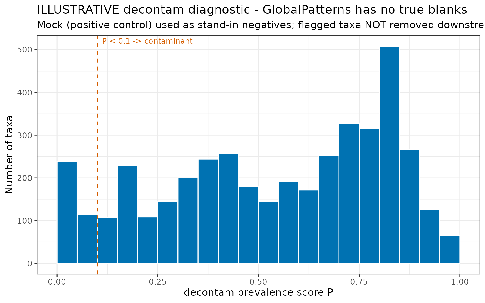

*Expected output (illustrative — GlobalPatterns has no extraction blanks, so the Mock community stands in as negatives and nothing is removed downstream). Bars count taxa at each decontam score; taxa left of the dashed P < 0.1 line are flagged. With real blanks, these would be your candidate contaminants.*

**Build `ps_raw`, your raw-counts phyloseq object.** This bundles counts, taxonomy, and metadata into one object. When you subset samples or remove taxa later, all three tables stay synchronised.

```r
ps_raw <- phyloseq(otu_table(counts_raw, taxa_are_rows = TRUE),
                   tax_table(taxonomy),
                   sample_data(metadata))
ps_raw   # sanity check
```

You should see something like:

```
phyloseq-class experiment-level object
otu_table()   OTU Table:         [ 247 taxa and 12 samples ]
tax_table()   Taxonomy Table:    [ 247 taxa by 7 taxonomic ranks ]
sample_data() Sample Data:       [ 12 samples by 7 sample variables ]
```

If the numbers look wrong (zero taxa, wrong sample count), check that row/column names match between tables. Mismatched sample names are the most common cause:

```r
# Diagnostic for name mismatches
cat("Count table columns:\n");        print(colnames(counts_raw))
cat("Metadata rows:\n");              print(rownames(metadata))
cat("Matching:\n");                   print(intersect(colnames(counts_raw),
                                                       rownames(metadata)))
cat("In counts but not metadata:\n"); print(setdiff(colnames(counts_raw),
                                                     rownames(metadata)))

# Save a checkpoint so you can reload without re-running everything
saveRDS(ps_raw, "checkpoint_ps_raw.rds")
# Reload later with: ps_raw <- readRDS("checkpoint_ps_raw.rds")
```

## **5. Explore Your Data Before Analysis**

Explore your data before any formal statistics. This step catches problems that would otherwise silently corrupt your results.

**Check library sizes (total reads per sample):**

```r
sort(sample_sums(ps_raw))
barplot(sort(sample_sums(ps_raw)), las = 2, ylab = "Total reads",
        main = "Library sizes per sample")
```

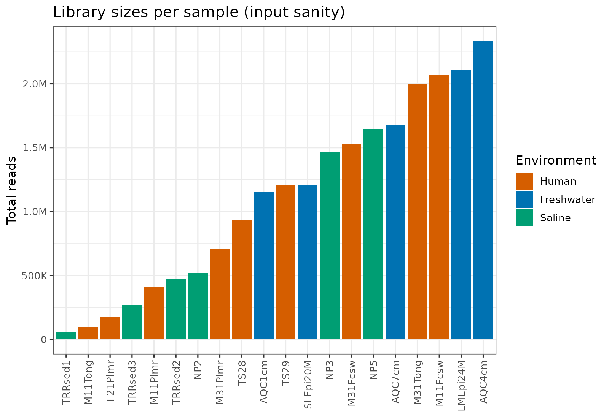

*Expected output. Total reads per sample, sorted and coloured by group. In the example every sample clears the 1,000-read floor, and depth spans roughly 50,000 to over 2 million reads — a wide but workable range.*

Flag samples below ~1,000 reads as unreliable and treat those below ~10,000 with caution. A 10-fold range between highest and lowest depth is common and manageable with normalisation; 100-fold suggests a problem. Also check whether library size is correlated with your treatment groups:

```r
boxplot(sample_sums(ps_raw) ~ sample_data(ps_raw)$Site,
        main = "Read depth by group", ylab = "Total reads", las = 2)
# If treated samples have systematically lower depth than controls,
# downstream results may be confounded by depth.
```

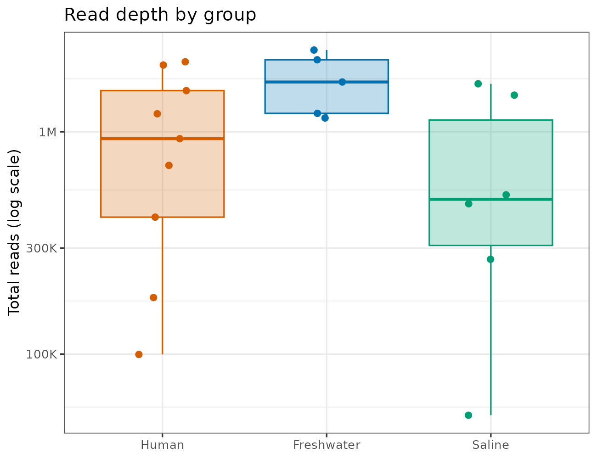

*Expected output. Read depth per group on a log scale. Look for one group sitting systematically deeper than the others, which would confound diversity with sequencing effort; in the example the groups overlap.*

**Check for batch effects.** If samples were sequenced across multiple runs or extracted on different days, check whether batch drives more variation than biology. If batch explains more variation than your treatment, your biological results may be unreliable.

```r
# ps_srs does not exist yet, and Bray-Curtis on raw counts is depth-sensitive —
# batch usually correlates with depth, so a raw-count batch test can report a
# "batch effect" that is really a sequencing-depth effect. Build a
# proportions-only object for these QC looks. It is used for QC ONLY and is
# never referenced again after this stage.
ps_rel_qc <- transform_sample_counts(ps_raw, function(x) x / sum(x))

quick_ord <- ordinate(ps_rel_qc, "PCoA", "bray")

plot_ordination(ps_rel_qc, quick_ord, color = "Batch") +
    geom_point(size = 3) + theme_bw() +
    ggtitle("Coloured by extraction batch")

# Test batch with PERMANOVA if you have a batch variable
# adonis2(phyloseq::distance(ps_rel_qc, "bray") ~ Batch,
#         data = data.frame(sample_data(ps_rel_qc)),
#         permutations = how(nperm = 9999), by = "terms")
# Swap Batch for Plate to check plate effects the same way.
```

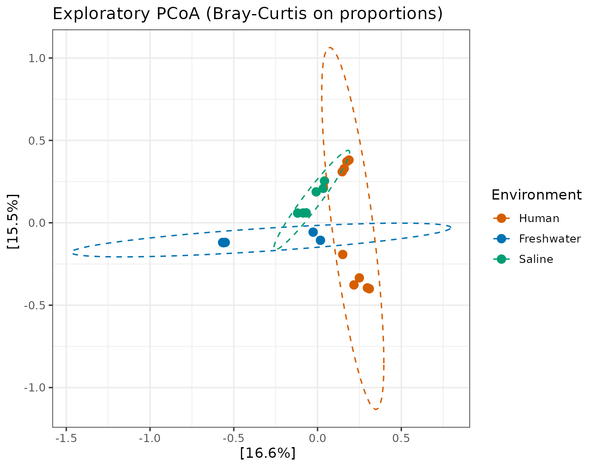

*Expected output. A first PCoA (Bray-Curtis on proportions) coloured by group — the most informative look before any test. Strong separation this early flags the main structure; in the example the three environments pull well apart.*

Proportions remove the gross depth effect but not the detection effect — a deeper sample still shows more rare taxa. If batch comes out significant here, check it against the depth boxplot above before concluding it is a batch effect.

Minimising batch effects starts in the wet lab: randomise samples across extraction batches and plate positions. Do not extract all treatment samples on one day and all controls on another, and do not put all samples from one group in the same plate row.

If samples cluster by batch rather than biology, your options are: (1) include batch as a covariate (`~ batch + treatment`); (2) if batch and treatment are not confounded, use a batch-correction tool; (3) if batch is completely confounded with treatment, the design has a problem statistics cannot fully fix, and you should acknowledge it as a limitation.

**Inspect the taxonomy table:**

```r
apply(tax_table(ps_raw), 2, function(x) sum(is.na(x) | x == ""))
head(tax_table(ps_raw))
```

Watch for inconsistent naming, NAs through the ranks, or suspiciously many taxa classified only to phylum level (a possible database or classification issue).

**Identify outlier samples.** An outlier might be a contaminated extraction, a mislabelled tube, or a genuine biological extreme.

```r
dist_temp <- phyloseq::distance(ps_rel_qc, method = "bray")
avg_dist  <- rowMeans(as.matrix(dist_temp))
sort(avg_dist, decreasing = TRUE)   # highest values are most dissimilar
```

Investigate before removing. Only remove outliers with documented justification, and always run a sensitivity analysis with and without the outlier to check whether your conclusions change.

## **6. Normalise to ps_srs**

**The problem.** Samples have different sequencing depths. Sample A with 50,000 reads will appear more diverse than Sample B with 5,000, because deeper sequencing catches rarer taxa. Comparing diversity without accounting for this compares sequencing effort, not biology.

**Why there's no single answer.** Microbiome counts have three awkward properties: uneven library sizes, compositionality (proportions sum to 1), and zero-inflation. No single normalisation handles all three, which is why different analyses use different approaches.

The main methods:

**Rarefaction** randomly subsamples each sample to the depth of the shallowest, repeated many times (typically 1,000), and averages the result. The 2014 McMurdie & Holmes paper argued rarefying "wastes data." Schloss (2024, *mSphere* 9(1):e00355-23) reproduced that analysis, identified 11 factors that compromised the original results, and showed rarefaction was the most reliable method for controlling uneven sequencing effort across both alpha and beta diversity. The companion paper (Schloss 2024, *mSphere* 9(2):e00354-23) extends this. Note the distinction:

- **Rarefying** = a single random subsample. Noisy, and the practice that was criticised. `phyloseq::rarefy_even_depth()` does this.
- **Rarefaction** = averaging a metric across many (1,000+) subsamplings. This cancels the noise and is robust. `vegan::avgdist()` does this for distance matrices.

Schloss found rarefaction the only method that decoupled diversity from depth across every metric tested. He also found that Aitchison distance — Euclidean distance after a centred-log-ratio (CLR) transform, defined with TSS and CSS in Appendix B — still tracked depth on sparse data. That is a caution, not a veto: we report Aitchison alongside Bray-Curtis (not instead of it), use the robust rCLR variant, and check in Step 2 that the Aitchison ordination is not tracking library size.

**SRS (Scaling with Ranked Subsampling)** is a deterministic alternative. It scales counts proportionally to a target depth (**Cmin**), then distributes rounding remainders to taxa ranked by their fractional remainders.

**Cmin** is the total read count of your shallowest sample. SRS scales every sample to this depth. If your shallowest sample has 8,200 reads, Cmin = 8,200 and every sample is scaled to exactly that total. If Cmin is very low (below ~1,000), that shallow sample is dragging everyone down; consider removing it and recalculating.

We use SRS as our primary method because it is deterministic and reproducible. It is also available as an interactive Shiny app (`SRS::SRS.shiny.app()`) for exploring how different Cmin values affect your data before committing.

Other methods — CLR (which makes Aitchison distance work), TSS and CSS, and when each applies — are catalogued in Appendix B.

**Which normalisation for which analysis:**

| Analysis | Use | phyloseq object | Why |
|---|---|---|---|
| Alpha diversity | SRS | `ps_srs` | Decouples richness from depth |
| Beta diversity (Bray-Curtis) | SRS | `ps_srs` | Needs non-negative counts |
| Beta diversity (Aitchison) | rCLR (internal) | `ps_raw` | Compositionally correct; handles zeros |
| Differential abundance (ANCOM-BC2) | Raw counts | `ps_raw` | Corrects bias internally |
| Differential abundance (MaAsLin2) | Raw counts | `ps_raw` | Applies TSS + log internally |
| Differential abundance (ALDEx2) | Raw counts | `ps_raw` | Applies CLR internally |
| Taxonomy barplots | TSS (relative) | `ps_srs` then aggregate | Visual interpretability |

**Feeding pre-normalised data to ANCOM-BC2, MaAsLin2, or ALDEx2 produces incorrect results.** These tools require raw counts and perform their own normalisation; applying SRS or CLR first interferes with their statistical models.

Start with a rarefaction curve:

```r
rarecurve(t(counts_raw), step = 100, lwd = 2, ylab = "Taxa", label = FALSE)
abline(v = min(rowSums(t(counts_raw))))
```

Each line is a sample; the x-axis is subsampling depth, the y-axis is taxa detected. Curves should plateau; if still rising steeply, that sample was not sequenced deeply enough. The vertical line marks your shallowest sample.

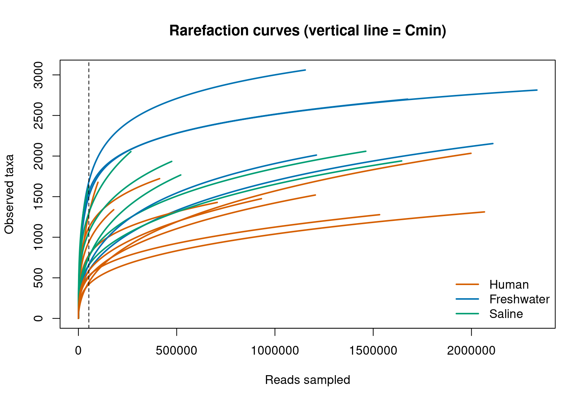

*Expected output. Each line is a sample, coloured by group; the dashed vertical line is Cmin (the shallowest sample). Freshwater samples reach the most taxa. Curves still climbing steeply at Cmin would warn of under-sequencing.*

**Run SRS to build `ps_srs`:**

```r
# Depth gate. Apply this BEFORE normalising, and rebuild ps_raw from the
# filtered tables — ps_raw and ps_srs must always hold the same samples.
# 1,000 reads is the floor flagged above: below that, richness estimates
# are dominated by sampling effort rather than biology.
depth_floor <- 1000
keep <- colSums(counts_raw) >= depth_floor
if (any(!keep)) {
    cat("Dropping", sum(!keep), "sample(s) below", depth_floor, "reads:",
        paste(colnames(counts_raw)[!keep], collapse = ", "), "\n")
}
counts_raw <- counts_raw[, keep, drop = FALSE]
counts_raw <- counts_raw[rowSums(counts_raw) > 0, , drop = FALSE]
taxonomy   <- taxonomy[rownames(counts_raw), , drop = FALSE]
metadata   <- metadata[colnames(counts_raw), , drop = FALSE]

# Rebuild ps_raw. Do not skip this line: every Aitchison and differential
# abundance step below reads from ps_raw, and a stale ps_raw will run
# without error on the samples you thought you had removed.
ps_raw <- phyloseq(otu_table(counts_raw, taxa_are_rows = TRUE),
                   tax_table(taxonomy),
                   sample_data(metadata))

Cmin <- min(colSums(counts_raw))
cat("Normalising to:", Cmin, "reads\n")

counts_srs <- SRS(counts_raw, Cmin = Cmin, set_seed = TRUE)
counts_srs <- as.data.frame(counts_srs)
rownames(counts_srs) <- rownames(counts_raw)
colnames(counts_srs) <- colnames(counts_raw)

ps_srs <- phyloseq(otu_table(counts_srs, taxa_are_rows = TRUE),
                   tax_table(taxonomy),
                   sample_data(metadata))

# Both objects must now agree on samples. If this stops, do not continue.
stopifnot(identical(sample_names(ps_raw), sample_names(ps_srs)))
```

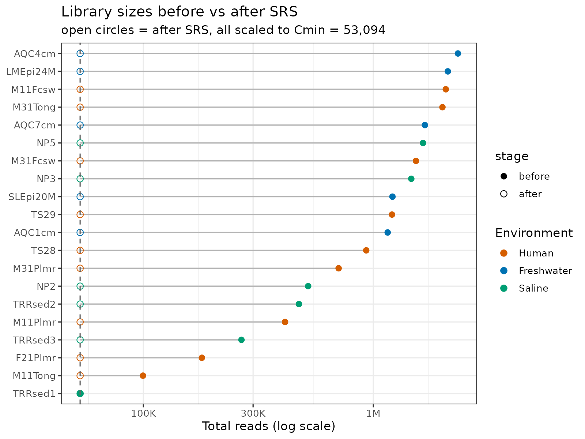

*Expected output. Filled points are raw depth, open points after SRS. Every sample is scaled to the same Cmin (here 53,094 reads, dashed line), which removes depth as a driver of the analyses built on `ps_srs`.*

## **7. Alpha Diversity**

Alpha diversity measures diversity within a single sample: how many taxa are present and how evenly distributed. A pristine soil might hold thousands of species in roughly equal abundance (high alpha diversity); an antibiotic-treated gut might hold a handful with one dominating (low alpha diversity).

**Metrics:**

- **Observed richness** is the count of taxa detected. Simple, but ignores abundance and is the most sensitive to sequencing depth, which is why normalisation matters.
- **Shannon index (H')** weights each species by the log of its proportional abundance: H' = -Σ(pᵢ × ln pᵢ). It captures both richness and evenness. Gut microbiomes typically range 2 to 5.
- **Simpson index (1-D)** is the probability that two random reads come from different taxa: 1 - Σ(pᵢ²), ranging 0 to 1. Less sensitive to rare species than Shannon, so more robust under uneven depth but liable to miss rare-taxon differences.

Report at least Observed and Shannon. If they disagree (same Observed, different Shannon), the difference between groups is about evenness rather than richness, which is biologically interesting.

**Testing.** Use the **Wilcoxon rank-sum test** (Mann-Whitney U), a non-parametric test that does not assume normality. For three or more groups, first run a **Kruskal-Wallis** omnibus test; only proceed to pairwise Wilcoxon comparisons if it is significant (p < 0.05). This avoids running pairwise tests when there is no overall effect.

```r
# Compute alpha diversity on the SRS-normalised object
alpha_div      <- estimate_richness(ps_srs, measures = c("Observed", "Shannon"))
alpha_div$Site <- sample_data(ps_srs)$Site
alpha_div$Sex  <- sample_data(ps_srs)$Sex

# Omnibus test for >2 groups
kw_obs <- kruskal.test(Observed ~ Site, data = alpha_div)
print(kw_obs)

# BH-adjusted pairwise p-values. These are the numbers you report AND the
# numbers the figure must show.
pw_obs <- pairwise.wilcox.test(alpha_div$Observed, alpha_div$Site,
                               p.adjust.method = "BH")$p.value
print(pw_obs)
```

**Draw the figure from these adjusted p-values — never let the plot compute its own.** `stat_compare_means()` silently runs *unadjusted* Wilcoxon tests and brackets every comparison, ignoring the Kruskal-Wallis gate above. Left in, it can stamp a `*` on data the text calls non-significant — and the figure is what goes into the thesis. The helper below turns the adjusted matrix into brackets so there is only ever one set of numbers:

```r
# Turn a BH-adjusted pairwise p-value matrix into the frame
# stat_pvalue_manual() draws from, gated on the omnibus test.
bracket_frame <- function(pw, values, omnibus_p, alpha = 0.05) {
    if (is.na(omnibus_p) || omnibus_p >= alpha) return(NULL)   # gate: no brackets
    st <- as.data.frame(as.table(pw), stringsAsFactors = FALSE)
    names(st) <- c("group1", "group2", "p.adj")
    st <- st[!is.na(st$p.adj), , drop = FALSE]
    if (nrow(st) == 0) return(NULL)
    st$p.adj.signif <- as.character(
        symnum(st$p.adj, corr = FALSE,
               cutpoints = c(0, 0.0001, 0.001, 0.01, 0.05, 1),
               symbols   = c("****", "***", "**", "*", "ns")))
    st$y.position <- max(values, na.rm = TRUE) * (1.05 + 0.09 * seq_len(nrow(st)))
    st
}

stat_obs <- bracket_frame(pw_obs, alpha_div$Observed, kw_obs$p.value)

p_obs <- plot_richness(ps_srs, x = "Site", measures = "Observed") +
    geom_boxplot() + stat_n_text() + theme_bw() +
    theme(legend.title = element_blank(), legend.position = "none",
          strip.background = element_blank(), strip.text.x = element_blank()) +
    xlab("Site") + ylab("Observed richness")

if (!is.null(stat_obs)) p_obs <- p_obs + stat_pvalue_manual(stat_obs, label = "p.adj.signif")
p_obs
```

Shannon takes its own omnibus test — do not reuse the Observed result:

```r
kw_sha   <- kruskal.test(Shannon ~ Site, data = alpha_div)
print(kw_sha)
pw_sha   <- pairwise.wilcox.test(alpha_div$Shannon, alpha_div$Site,
                                 p.adjust.method = "BH")$p.value
stat_sha <- bracket_frame(pw_sha, alpha_div$Shannon, kw_sha$p.value)

p_sha <- plot_richness(ps_srs, x = "Site", measures = "Shannon") +
    geom_boxplot() + stat_n_text() + theme_bw() +
    theme(legend.title = element_blank(), legend.position = "none",
          strip.background = element_blank(), strip.text.x = element_blank()) +
    xlab("Site") + ylab("Shannon diversity index")

if (!is.null(stat_sha)) p_sha <- p_sha + stat_pvalue_manual(stat_sha, label = "p.adj.signif")
p_sha
```

In the boxplots, the central line is the median, the box is the interquartile range, and the whiskers extend to the most extreme points within 1.5× the IQR. Asterisks mark significance: \* p < 0.05, \*\* p < 0.01, \*\*\* p < 0.001, \*\*\*\* p < 0.0001, `ns` not significant. A visible trend that is not significant usually means the sample size is too small or within-group variation too large.

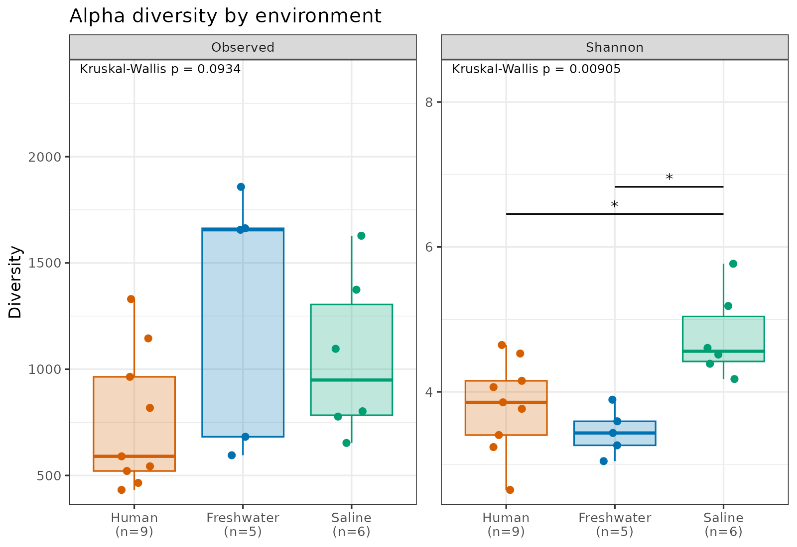

*Expected output. Observed richness and Shannon by group, with the Kruskal-Wallis p-value and BH-adjusted brackets drawn from the adjusted matrix. In the example Observed richness does not differ (p = 0.093) but Shannon does (p = 0.009) — a difference in evenness, not richness.*

Repeat for other variables. With exactly two groups there is no omnibus step, so the Wilcoxon test is the reported result and no adjustment across comparisons is needed:

```r
w_sex <- wilcox.test(Observed ~ Sex, data = alpha_div)
print(w_sex)

stat_sex <- data.frame(
    group1 = "Female", group2 = "Male",
    p.adj  = w_sex$p.value,
    p.adj.signif = as.character(
        symnum(w_sex$p.value, corr = FALSE,
               cutpoints = c(0, 0.0001, 0.001, 0.01, 0.05, 1),
               symbols   = c("****", "***", "**", "*", "ns"))),
    y.position = max(alpha_div$Observed, na.rm = TRUE) * 1.05)

plot_richness(ps_srs, x = "Sex", measures = "Observed") +
    geom_boxplot() + stat_n_text() + theme_bw() +
    theme(legend.title = element_blank(), legend.position = "none",
          strip.background = element_blank(), strip.text.x = element_blank()) +
    xlab("Sex") + ylab("Observed richness") +
    stat_pvalue_manual(stat_sex, label = "p.adj.signif") +
    theme(text = element_text(size = 15))
```

## **8. Beta Diversity**

Beta diversity measures dissimilarity between communities. Two samples with identical species in identical proportions have zero beta diversity; two sharing no species have maximum beta diversity.

The workflow is six steps: (1) calculate distance matrices, (2) ordinate, (3) check dispersion, (4) PERMANOVA, (5) pairwise PERMANOVA if >2 groups, and (6) an optional Jaccard (presence/absence) lens.

### **Step 1: Distance Matrices**

A distance matrix holds the dissimilarity between every pair of samples. We calculate two, because each captures different aspects of community difference.

**Bray-Curtis dissimilarity** is the traditional workhorse:

BC = 1 - (2 × sum of shared minimum abundances) / (total abundance in both samples)

It takes the smaller count of each taxon between two samples (what they share), sums these, and divides by the total. Identical communities score 0; communities sharing nothing score 1. It uses both presence and abundance, and is what most published 16S studies use.

**Aitchison distance** is the compositionally appropriate alternative. Sequencing data is compositional — each sample has a fixed read total, so if one taxon's proportion rises the others must fall, even with no real change. Bray-Curtis ignores this, which distorts distances when a few taxa dominate.

Aitchison distance applies a CLR transformation (divide each count by the sample's geometric mean, then take the log) and measures ordinary Euclidean distance in that space, where taxa behave independently.

```r
# Bray-Curtis (uses ps_srs)
dist_bray <- phyloseq::distance(ps_srs, method = "bray")

# Robust Aitchison (uses ps_raw; rCLR handles depth internally)
counts_raw_t <- t(as(otu_table(ps_raw), "matrix"))
dist_ait     <- vegdist(counts_raw_t, method = "robust.aitchison")
```

**Why `robust.aitchison`?** Standard CLR cannot handle zeros (you cannot log zero), so `method = "aitchison"` requires a pseudocount, which distorts results when zeros are common. The robust version uses a modified CLR that computes the geometric mean and log-ratios from non-zero values only, avoiding the problem. This is the recommended approach for sparse data like Nanopore 16S.

If your conclusions agree across both metrics, you can be more confident they are robust. If they differ, the compositional structure of your data matters and you should think about which interpretation fits. Present both.

### **Step 2: Ordination**

Ordination compresses the distance matrix into a 2D plot where each sample is a point and on-plot distances approximate community dissimilarities. It is the single most informative plot before any test: it shows whether groups separate, whether there are outliers, and whether a confounder (batch, extraction date, run) drives more variation than your biological variable.

Two main methods:

- **PCoA (Principal Coordinates Analysis)** performs eigenvalue decomposition of the distance matrix, producing axes ranked by variation explained. Each axis has a concrete meaning ("Axis 1 explains 35% of the variation"), which is what reviewers expect.
- **NMDS (Non-metric Multidimensional Scaling)** preserves the rank order of distances and reports a stress value, but its axes carry no inherent meaning and cannot be labelled with % variance. It is non-deterministic unless you set a seed.

We use **PCoA by default** because eigenvalue-labelled axes are more informative and the method is deterministic. NMDS is a fallback. (dbRDA, a constrained ordination, exists for visualising how specific predictors structure the community, but is more complex and not covered here.)

**PCoA with Bray-Curtis (uses `ps_srs`):**

```r
pcoa_bray  <- ordinate(ps_srs, method = "PCoA", distance = dist_bray)
evals_bray <- pcoa_bray$values$Relative_eig
pc1_bray   <- round(100 * evals_bray[1], 1)
pc2_bray   <- round(100 * evals_bray[2], 1)

plot_ordination(ps_srs, pcoa_bray, color = "Site") +
    geom_point(size = 3) + theme_bw() +
    stat_ellipse(type = "norm", linetype = 2) +
    labs(x = paste0("PCoA Axis 1 (", pc1_bray, "%)"),
         y = paste0("PCoA Axis 2 (", pc2_bray, "%)"),
         title = "Bray-Curtis (SRS-normalised counts)") +
    theme(text = element_text(size = 15))
```

**PCoA with Aitchison (uses `ps_raw`):**

Aitchison distance is computed on raw counts. rCLR is a per-sample log-ratio, so scaling a sample's counts by a constant leaves the transformed values unchanged and applying SRS first would throw reads away for no gain. What rCLR does *not* remove is depth-dependent *detection*: a deeper sample has more non-zero taxa, which is why Schloss (2024) found Aitchison distance still tracked depth on sparse data. Compute the ordination first, then check whether depth is driving it:

```r
pcoa_ait  <- ordinate(ps_raw, method = "PCoA", distance = dist_ait)
evals_ait <- pcoa_ait$values$Relative_eig
pc1_ait   <- round(100 * evals_ait[1], 1)
pc2_ait   <- round(100 * evals_ait[2], 1)

plot_ordination(ps_raw, pcoa_ait, color = "Site") +
    geom_point(size = 3) + theme_bw() +
    stat_ellipse(type = "norm", linetype = 2) +
    labs(x = paste0("PCoA Axis 1 (", pc1_ait, "%)"),
         y = paste0("PCoA Axis 2 (", pc2_ait, "%)"),
         title = "Aitchison (robust CLR, raw counts)") +
    theme(text = element_text(size = 15))
```

Colour the same ordination by library size to see whether depth is driving Axis 1:

```r
sample_data(ps_raw)$LibSize <- sample_sums(ps_raw)
plot_ordination(ps_raw, pcoa_ait, color = "LibSize") +
    geom_point(size = 3) + theme_bw() +
    labs(title = "Aitchison PCoA coloured by library size")
```

If Axis 1 grades smoothly with library size rather than separating your groups, the Aitchison result is depth-driven. Report Bray-Curtis on `ps_srs` as your primary metric, say so, and present the Aitchison ordination with the library-size colouring as a caveat.

Make the same plots coloured by other variables:

```r
plot_ordination(ps_srs, pcoa_bray, color = "Sex") +
    geom_point(size = 3) + theme_bw() +
    stat_ellipse(type = "norm", linetype = 2) +
    labs(x = paste0("PCoA Axis 1 (", pc1_bray, "%)"),
         y = paste0("PCoA Axis 2 (", pc2_bray, "%)")) +
    theme(text = element_text(size = 15))
```

Closer points have more similar communities. The axis labels show how much total variation each axis captures. Ellipses show the 95% confidence region per group; non-overlapping ellipses suggest groups differ, but only PERMANOVA confirms it.

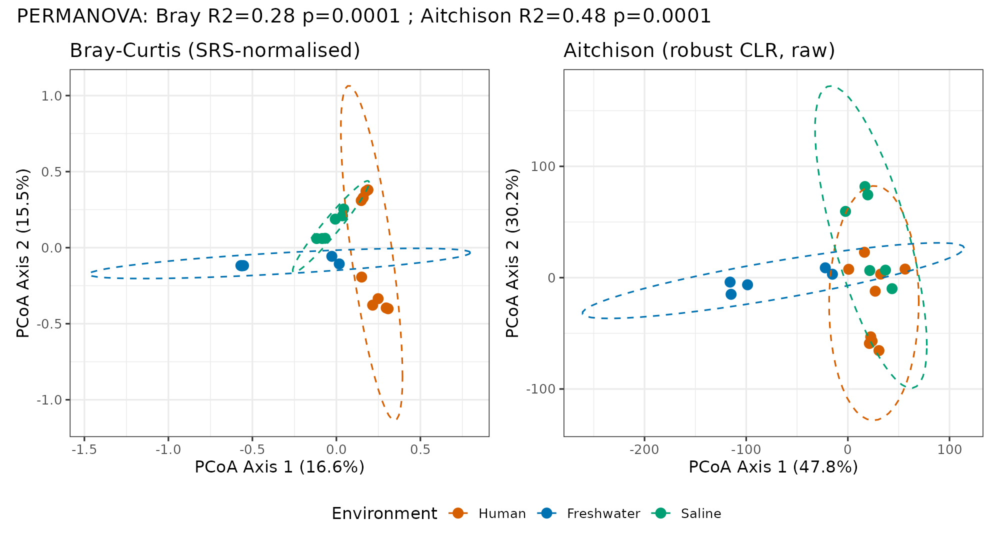

*Expected output. PCoA on Bray-Curtis (SRS) and robust Aitchison (raw counts); axis labels show variance explained. The three groups separate on both metrics (PERMANOVA R² = 0.28 and 0.48, both p = 0.0001), so the result does not hinge on one distance.*

**Negative eigenvalues.** PCoA on Bray-Curtis sometimes produces negative eigenvalues because Bray-Curtis is semi-metric. Small ones are normal and can be ignored. If they are large, the Aitchison PCoA (a true metric distance) is more reliable.

**NMDS fallback.** If PCoA produces many large negative eigenvalues, use NMDS:

```r
set.seed(42)   # NMDS uses random starts; lock the seed for reproducible figures
# Runtime: trymax=999 can take a minute or two; it is iterating, not stuck.
nmds_bray <- ordinate(ps_srs, method = "NMDS", distance = "bray",
                      trymax = 999, autotransform = TRUE)
stressplot(nmds_bray)   # stress < 0.2 acceptable; < 0.1 good
```

`set.seed()` keeps reruns identical (NMDS starts from random configurations). `trymax = 999` gives metaMDS enough random starts to find a stable solution on small or noisy datasets; the default 20 is often too few. If NMDS still reports "did not converge" at 999, that signals your data does not admit a clean 2D embedding, usually too few samples or too little between-group variation. Stress interpretation: < 0.05 excellent, < 0.1 good, < 0.2 acceptable, > 0.2 unreliable.

### **Step 3: Check Dispersion**

Before testing whether group centroids differ, check that the within-group spread (dispersion) is roughly equal. PERMANOVA assumes this; if one group is much more spread out, a significant result could reflect that unequal spread rather than different compositions.

Check both metrics, pairing each distance with metadata from the object it was built on (Bray-Curtis with `ps_srs`, Aitchison with `ps_raw`):

```r
# Bray-Curtis dispersion (ps_srs metadata)
disp_site_bray <- betadisper(dist_bray, sample_data(ps_srs)$Site)
permutest(disp_site_bray)   # p > 0.05 = dispersions equal (good)
disp_sex_bray  <- betadisper(dist_bray, sample_data(ps_srs)$Sex)
permutest(disp_sex_bray)

# Aitchison dispersion (ps_raw metadata)
disp_site_ait <- betadisper(dist_ait, sample_data(ps_raw)$Site)
permutest(disp_site_ait)
disp_sex_ait  <- betadisper(dist_ait, sample_data(ps_raw)$Sex)
permutest(disp_sex_ait)
```

Always pair the distance with metadata from the same phyloseq object it was computed on. Mixing them works only because `ps_raw` and `ps_srs` share sample order, and will fail silently if you ever drop or reorder samples between the two.

**Visualising dispersion.** `permutest()` tells you whether dispersions differ, not how or by how much. Two plots make it interpretable: the **centroid plot** (each sample, its group centroid, and the connecting ray) and the **distance-to-centroid boxplot** (the raw distances the test operates on). `betadisper()` runs its own PCoA internally, so these axes match your Step 2 PCoA up to sign/rotation.

Quick base R version for diagnostics:

```r
plot(disp_site_bray, main = "Bray-Curtis: centroids and dispersion", sub = "")
plot(disp_site_ait,  main = "Aitchison: centroids and dispersion",   sub = "")
boxplot(disp_site_bray, main = "Distance to centroid (Bray-Curtis)", xlab = "Site")
boxplot(disp_site_ait,  main = "Distance to centroid (Aitchison)",   xlab = "Site")
```

For figure-quality output, define these two helpers once near your `library()` calls, then call them on any betadisper object:

```r
# Centroid plot: sample points, group centroids, and connecting rays
plot_betadisper_centroids <- function(bd, title = "") {

  scrs <- as.data.frame(bd$vectors[, 1:2]) %>%
    rownames_to_column("sample") %>%
    mutate(group = bd$group)
  colnames(scrs)[2:3] <- c("Axis1", "Axis2")

  cents <- as.data.frame(bd$centroids[, 1:2]) %>%
    rownames_to_column("group")
  colnames(cents)[2:3] <- c("Axis1", "Axis2")

  rays <- scrs %>%
    left_join(cents, by = "group", suffix = c("", ".cent"))

  eig    <- 100 * bd$eig / sum(bd$eig)
  ax1lab <- paste0("PCoA Axis 1 (", round(eig[1], 1), "%)")
  ax2lab <- paste0("PCoA Axis 2 (", round(eig[2], 1), "%)")

  ggplot() +
    geom_segment(data = rays,
                 aes(x = Axis1, y = Axis2,
                     xend = Axis1.cent, yend = Axis2.cent,
                     colour = group),
                 alpha = 0.5, linewidth = 0.3) +
    geom_point(data = scrs,
               aes(x = Axis1, y = Axis2, colour = group),
               size = 2, alpha = 0.85) +
    geom_point(data = cents,
               aes(x = Axis1, y = Axis2, fill = group),
               shape = 23, size = 4.5, colour = "black", stroke = 0.7) +
    labs(x = ax1lab, y = ax2lab, title = title,
         colour = NULL, fill = NULL) +
    theme_bw() +
    theme(text = element_text(size = 13),
          legend.position = "bottom")
}

# Boxplot of distance-to-centroid (the quantity betadisper tests)
plot_betadisper_distance <- function(bd, title = "") {

  df <- data.frame(distance = bd$distances, group = bd$group)

  ggplot(df, aes(x = group, y = distance, colour = group, fill = group)) +
    geom_boxplot(outlier.shape = NA, alpha = 0.3, linewidth = 0.5) +
    geom_jitter(width = 0.18, height = 0, size = 2, alpha = 0.8) +
    labs(x = NULL, y = "Distance to group centroid", title = title) +
    theme_bw() +
    theme(legend.position = "none", text = element_text(size = 13))
}

plot_betadisper_centroids(disp_site_bray, "Bray-Curtis dispersion")
plot_betadisper_centroids(disp_site_ait,  "Aitchison dispersion")
plot_betadisper_distance(disp_site_bray,  "Bray-Curtis: distance to centroid by Site")
plot_betadisper_distance(disp_site_ait,   "Aitchison: distance to centroid by Site")
```

In the centroid plot, each point is a sample, each diamond a group centroid, and the ray length is the distance betadisper tests — long rays mean high dispersion. In the boxplot, the y-axis is each sample's distance to its own centroid; a visibly higher box means the test will likely return p < 0.05.

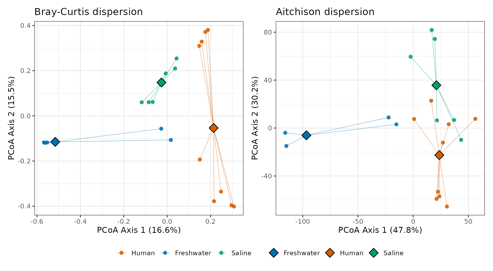

*Expected output. Each point is a sample joined by a ray to its group centroid (diamond), for both metrics. Roughly comparable spread across groups means dispersion is not driving the PERMANOVA (betadisper p = 0.38 and 0.56 in the example).*

The centroid plot shows the spatial pattern, the boxplot the magnitude. For a thesis figure publish the centroid plot; keep the boxplot for supplementary material or for diagnosing a surprising result.

These plots live in the same coordinate space as your Step 2 PCoA. The PCoA answers the location question (do groups occupy different regions? tested by PERMANOVA); the centroid plot answers the dispersion question (do groups have different spread? tested by betadisper). Reporting both makes clear whether a significant PERMANOVA reflects a location difference, a dispersion difference, or both.

If `permutest` returns p > 0.05, dispersions are equal and the assumption is met. If p < 0.05, you can still run PERMANOVA but must report it and note that a significant result could partly reflect different within-group variability.

### **Step 4: PERMANOVA**

PERMANOVA tests whether one group's centroid differs from another's in multivariate space, working on the distance matrix directly and testing all taxa simultaneously.

**How it works.** Unlike a t-test or ANOVA, PERMANOVA assumes no distribution — it builds its own null by reshuffling your data:

1. Compute the real F-statistic: variation explained by your grouping variable versus residual.
2. Shuffle the group labels and recompute F.
3. Repeat 9,999 times.
4. Count how many shuffled F values beat the real one. Fewer than 5% means p < 0.05 — if the groups were truly alike, shuffling would barely change F.

**What can and cannot be permuted.** The default permutes observations freely across all samples, valid only when all samples are independent. If your data has structure, restrict permutations:

- **Repeated measures** (same animal at multiple time points): use `permute::how()` with `blocks = Subject` to permute within individuals.
- **Nested designs** (samples within cages within treatments): permute the independent unit (cage labels, not mouse labels, if mice share a cage).
- **Blocked designs** (paired before/after): restrict permutations within blocks to preserve pairing.

Ignoring these constraints inflates your false positive rate.

**Sequential vs marginal testing.** With multiple terms (e.g. `Site * Sex`), the `by` argument controls how each is tested.

- **Sequential** (`by = "terms"`) tests each term in formula order: Site first, then Sex on the remaining variation, then the interaction. R² values partition the total cleanly and sum to 1, but formula order matters (`Sex * Site` and `Site * Sex` give different main effects).
- **Marginal** (`by = "margin"`) tests each term as if added last, like Type III sums of squares. Order does not matter, but the interaction term is often not properly estimable and R² values no longer partition cleanly.

**Note on the `adonis2` default:** in recent vegan versions (2.6-8 and later) the default is now an omnibus test (`by = NULL`), not sequential. Earlier versions defaulted to `by = "terms"`. Always pass `by = "terms"` explicitly if you want sequential testing, as below. We use sequential testing here because it gives all terms including the interaction, with cleanly partitioning R² values. Put your primary variable first.

```r
# Permutation scheme: free permutation, 9,999 permutations
perm_free <- how(nperm = 9999)

# Runtime: 9,999 permutations take a few seconds to ~a minute.
# Bray-Curtis (ps_srs metadata)
adonis2(dist_bray ~ Site * Sex,
        data         = data.frame(sample_data(ps_srs)),
        permutations = perm_free,
        by           = "terms")

# Aitchison (ps_raw metadata)
adonis2(dist_ait ~ Site * Sex,
        data         = data.frame(sample_data(ps_raw)),
        permutations = perm_free,
        by           = "terms")
```

**Reading the output:**

- **R²** = proportion of total variation explained by that term. With sequential testing, all terms plus residual sum to 1.
- **Pr(>F)** = permutation p-value; < 0.05 is significant.
- `Site * Sex` expands to Site (main), Sex (after Site), and Site:Sex (interaction).
- Formula order matters with sequential testing; put your primary variable first.

**Reporting.** *Report in this form (numbers illustrative — they will not match the figure captions):* *"Microbial community composition differed significantly between sites based on both Bray-Curtis dissimilarity (PERMANOVA: R² = 0.38, p = 0.02) and Aitchison distance (R² = 0.35, p = 0.03), with site explaining 35-38% of the variation. Multivariate dispersions did not differ between sites for either metric (betadisper: Bray-Curtis p = 0.42, Aitchison p = 0.55)."*

### **Step 5: Pairwise PERMANOVA (for >2 Groups)**

A significant overall PERMANOVA tells you at least one group differs, but not which. For three or more groups, use pairwise post-hoc comparisons, as with pairwise Wilcoxon after Kruskal-Wallis.

```r
# devtools::install_github("pmartinezarbizu/pairwiseAdonis/pairwiseAdonis")
library(pairwiseAdonis)

# NOTE: pairwise.adonis2() does NOT adjust p-values. It has no p.adjust.m
# argument — anything passed there falls into `...` and is silently ignored
# (p.adjust.m belongs to the older pairwise.adonis(), a different function).
# So extract the per-pair p-values and apply the correction yourself.

# Bray-Curtis
pw_bray <- pairwise.adonis2(dist_bray ~ Site,
                            data = data.frame(sample_data(ps_srs)))

# Aitchison
pw_ait  <- pairwise.adonis2(dist_ait ~ Site,
                            data = data.frame(sample_data(ps_raw)))

# Pull each pair's p-value (dropping the 'parent_call' entry) and BH-adjust.
adjust_pairwise <- function(pw) {
    pairs <- pw[names(pw) != "parent_call"]
    p_raw <- sapply(pairs, function(res) res[["Pr(>F)"]][1])
    data.frame(pair  = names(p_raw),
               p_raw = p_raw,
               p_BH  = p.adjust(p_raw, method = "BH"),
               row.names = NULL)
}

adjust_pairwise(pw_bray)
adjust_pairwise(pw_ait)
```

`pairwise.adonis2()` performs no multiple-testing correction itself; `adjust_pairwise()` above extracts the raw per-pair p-values and applies Benjamini-Hochberg. **Report the `p_BH` column, not `p_raw`.** With three or more pairwise comparisons the corrected values are larger, so reporting the raw ones overstates significance. The output might show Takapourewa vs Zealandia significant (p_BH = 0.03) but Zealandia vs YoungNicksHead not (p_BH = 0.45).

### **Step 6 (Optional): Jaccard as a Third Lens**

Both Bray-Curtis and Aitchison use abundance; a taxon at 50% of reads dominates either calculation. A presence/absence metric asks a different question: do communities differ in which taxa are present, or only in how abundant the shared taxa are?

**Jaccard** is the standard presence/absence distance: the proportion of taxa not shared between two samples, ignoring how abundant each one is. Pass `binary = TRUE` so `vegdist` treats the data as presence/absence rather than abundances.

```r
counts_srs_t <- t(as(otu_table(ps_srs), "matrix"))
dist_jaccard <- vegdist(counts_srs_t, method = "jaccard", binary = TRUE)

# Dispersion check
disp_site_jaccard <- betadisper(dist_jaccard, sample_data(ps_srs)$Site)
permutest(disp_site_jaccard)
plot_betadisper_centroids(disp_site_jaccard, "Jaccard dispersion")

# PERMANOVA
adonis2(dist_jaccard ~ Site * Sex,
        data         = data.frame(sample_data(ps_srs)),
        permutations = perm_free,
        by           = "terms")
```

Jaccard and binary (presence/absence) Bray-Curtis are monotonic transformations of one another, so rank-based methods — NMDS, ANOSIM, rank-correlation Mantel tests — give identical results from either. PERMANOVA and PCoA are not rank-based: they work on the dissimilarity values themselves, so F, R² and p will differ slightly between the two. Pick one, name it in your methods, and do not swap them mid-analysis. Jaccard is the more conventional choice for a membership question and is what most readers will expect.

**Reading across all three metrics:**

- **Significant on weighted Bray-Curtis but not Jaccard:** same taxa, different proportions. The story is which taxa dominate, not which exist. Common in treatment-response or seasonal studies.
- **Significant on Jaccard but not weighted Bray-Curtis:** communities differ in membership but shared taxa sit in similar proportions. Common under strong environmental filtering or host-specificity.
- **Significant on both:** communities differ in both membership and abundance. The usual pattern for biologically distinct groups.
- **Significant on Aitchison but not weighted Bray-Curtis:** Aitchison is more sensitive to coordinated shifts across many low-to-moderate-abundance taxa and less dominated by a few common ones. The signal is real but masked in Bray-Curtis by abundance-weighted dominance.

Include this third metric if your question is specifically about membership (e.g. "do antibiotic-treated guts lose taxa?"). For composition questions broadly (most studies), the original two suffice.

## **9. Taxonomy Barplots**

Taxonomy barplots give a visual overview of which microbial groups dominate each sample, and are usually the first figure people look at. Merge rare taxa into an "Other" category to keep the plot readable; beyond about 10 categories the colours become indistinguishable.

```r
phy_top10 <- microbiomeutilities::aggregate_top_taxa2(ps_srs, 10, "phylum")
gen_top10 <- microbiomeutilities::aggregate_top_taxa2(ps_srs, 10, "genus")
phy_melt  <- psmelt(phy_top10)
gen_melt  <- psmelt(gen_top10)

# Phylum-level
ggplot(phy_melt, aes(x = Sample, y = Abundance, fill = phylum)) +
    geom_bar(stat = "identity", position = "fill") +
    ylab("Relative Abundance") +
    theme(panel.grid.major = element_blank(),
          panel.grid.minor = element_blank()) +
    scale_fill_brewer(palette = "Paired") +
    guides(fill = guide_legend(title = "Phylum")) +
    theme(axis.title.x = element_blank(),
          axis.text.x  = element_text(angle = 90, vjust = 0.5, hjust = 1))

# Genus-level
ggplot(gen_melt, aes(x = Sample, y = Abundance, fill = genus)) +
    geom_bar(stat = "identity", position = "fill") +
    ylab("Relative Abundance") +
    theme(panel.grid.major = element_blank(),
          panel.grid.minor = element_blank()) +
    scale_fill_brewer(palette = "Paired") +
    guides(fill = guide_legend(title = "Genus")) +
    theme(axis.title.x = element_blank(),
          axis.text.x  = element_text(angle = 90, vjust = 0.5, hjust = 1))
```

Each bar is one sample; colours show the proportion of each taxon. Look for taxa that appear more abundant in one group, or samples with unusual compositions. These plots are descriptive only: a taxon that looks bigger in one group may not be significant. For that, use the differential abundance tests below.

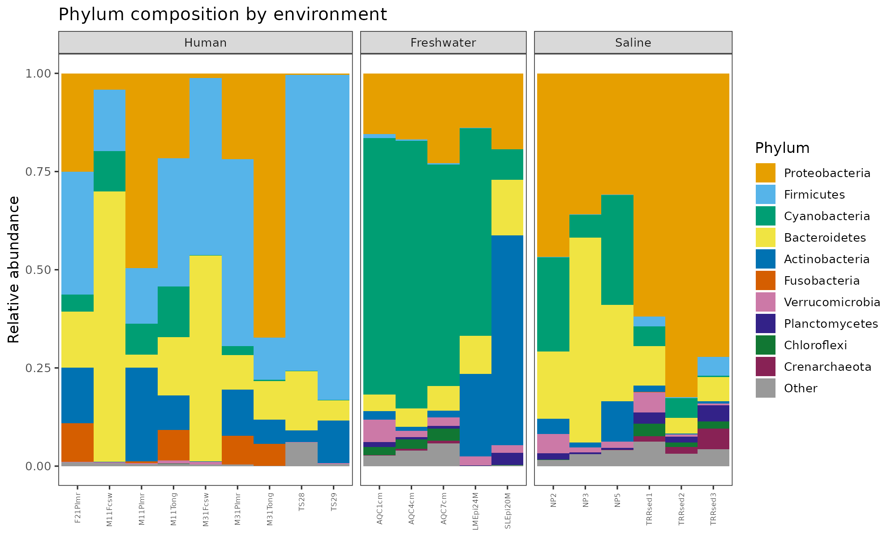

*Expected output. Relative phylum abundance per sample, faceted by group, top 10 phyla plus Other. Freshwater is Cyanobacteria-rich while the marine and human samples are dominated by Proteobacteria — descriptive leads for the tests below, not results.*

A lot of "Unknown" or "unassigned" at genus level can mean (a) genuinely novel bacteria absent from the reference database, (b) classification confidence too low for genus-level assignment, or (c) a problem in the classification step. Comparing SILVA and RDP results helps distinguish these.

## **10. Differential Abundance**

Differential abundance testing answers "which specific taxa drive the differences?" (Indicator species analysis, Section 11, answers a related question: which taxa are diagnostic of each group?)

### **Why You Can't Test Each Taxon on Its Own**

**Multiple testing.** With 500 taxa tested at p < 0.05, you would expect ~25 false positives by chance. Proper DA tools control this by adjusting p-values (FDR/Benjamini-Hochberg, Holm, or Bonferroni), so the results you keep are more trustworthy.

**Compositionality.** When you sequence a sample, the instrument produces a fixed number of reads, so counts are relative abundances in disguise: they tell you each taxon's proportion, not its absolute cell count. Because proportions must sum to 100%, taxa are not independent. If one taxon takes more of the pie, the others must take less, even if their absolute abundance did not change.

A concrete example. A gut sample with 1,000 cells each of Species A, B, and C yields ~1,000 reads each from 3,000 total. If a treatment doubles A (to 2,000 cells) while B and C are unchanged, the true total is 4,000 cells but the instrument still returns 3,000 reads: A ≈ 1,500, B ≈ 750, C ≈ 750.

It now looks like B and C dropped 25% when they did not change at all. A naive test would falsely report a decrease in B and C. This happens whenever any taxon truly changes, and is worst when a dominant taxon changes.

How our tools handle it:

- **Aitchison distance** applies CLR before computing distances, removing the fixed-sum constraint.
- **ANCOM-BC2** models the bias explicitly (observed = true abundance × sample-specific sampling fraction × taxon-specific efficiency), estimates the sampling fraction per sample, and subtracts it in log space.
- **MaAsLin2** fits linear models on log-transformed relative abundances with TSS. This does not fully solve compositionality theoretically, but in practice gives comparable results and is flexible for complex designs.
- **ALDEx2** uses Monte Carlo sampling from a Dirichlet posterior and applies CLR to each draw.

Compositionality matters most when (a) testing differential abundance, (b) correlating taxa (use SparCC or SPIEC-EASI, not Pearson/Spearman on proportions — Section 12 demonstrates SPIEC-EASI), and (c) when a few dominant taxa change sharply. It matters less for alpha diversity, compositionally aware ordinations (Aitchison), and taxonomy barplots.

**Our approach:** Bray-Curtis for continuity with the ecological literature plus Aitchison as the compositionally correct complement; for differential abundance, run ANCOM-BC2 and MaAsLin2 and report the consensus.

### **Differential Abundance with ANCOM-BC2**

ANCOM-BC2 estimates a sample-specific bias term (how much each sample's depth and technical factors shift observed abundances from truth), corrects for it, then tests each taxon with a linear model and multiple-testing correction.

Key features: handles compositionality through bias correction; detects **structural zeros** (taxa genuinely absent from a whole group, not undersampled); runs a **sensitivity analysis** across pseudo-count values; and controls FDR across all taxa.

Use `ps_raw`. ANCOM-BC2 performs its own normalisation; applying SRS first interferes with the bias correction.

```r
library(ANCOMBC)
set.seed(123)

# Runtime: seconds on a toy set, several minutes with pairwise + sensitivity
# on real data — let it run.
da_ancom <- ancombc2(
    data         = ps_raw,             # raw phyloseq (NOT ps_srs)
    tax_level    = "genus",
    fix_formula  = "Site + Sex",
    p_adj_method = "holm",
    prv_cut      = 0.10,               # remove taxa in <10% of samples
    lib_cut      = 1000,               # remove samples with <1,000 reads
    group        = "Site",
    struc_zero   = TRUE,
    neg_lb       = FALSE,             # see note below — do not flip this on small designs
    alpha        = 0.05,
    global       = TRUE,               # omnibus test across groups
    pairwise     = TRUE,
    pseudo_sens  = TRUE,               # sensitivity analysis
    verbose      = TRUE
)

head(da_ancom$res)
```

Parameters:

- `tax_level = "genus"` aggregates to genus before testing. Could be "species", "family", etc.
- `fix_formula = "Site + Sex"` tests both variables; add interactions with `Site * Sex`.
- `p_adj_method = "holm"` is a step-down Bonferroni: more powerful than Bonferroni while controlling family-wise error. `"BH"` controls FDR (more permissive, more results).
- `prv_cut = 0.10` removes taxa in fewer than 10% of samples (rare taxa lack power and add noise).
- `struc_zero = TRUE` flags taxa completely absent from one group, which cannot be tested with standard linear models.
- `neg_lb = FALSE` (the default, used here) controls the lower bound for calling a taxon structurally absent from a group. **Leave it FALSE unless each group holds roughly 30 or more samples** — below that the bound is unstable and invents structural zeros, which surface as strong, highly significant differences that really reflect under-sampling. The worked example has four per group, so it stays FALSE; check `?ancombc2` for the exact wording in your version.
- `pseudo_sens = TRUE` tests whether results hold across pseudo-count values (0.1, 0.5, 1.0); robustness shows in `passed_ss`.

Output columns (one set per non-reference level of the grouping variable; with Takapourewa as reference you get Zealandia and YoungNicksHead columns):

- `lfc_SiteZealandia`: log fold change vs Takapourewa. Positive = more abundant in Zealandia. lfc of 1 ≈ 2.7-fold, lfc of 2 ≈ 7.4-fold.
- `se_*`, `W_*` (lfc / se), `p_*` (raw), `q_*` (adjusted).
- `diff_*` is TRUE/FALSE for significantly differentially abundant.
- `passed_ss_*` is TRUE/FALSE for passing the sensitivity analysis.

**Trust results only where both `diff_` and `passed_ss_` are TRUE.** A result significant by `diff_` but failing `passed_ss_` may be an artefact of how zeros were handled.

```r
sig_ancom <- da_ancom$res %>%
  filter(diff_SiteZealandia == TRUE & passed_ss_SiteZealandia == TRUE)
```

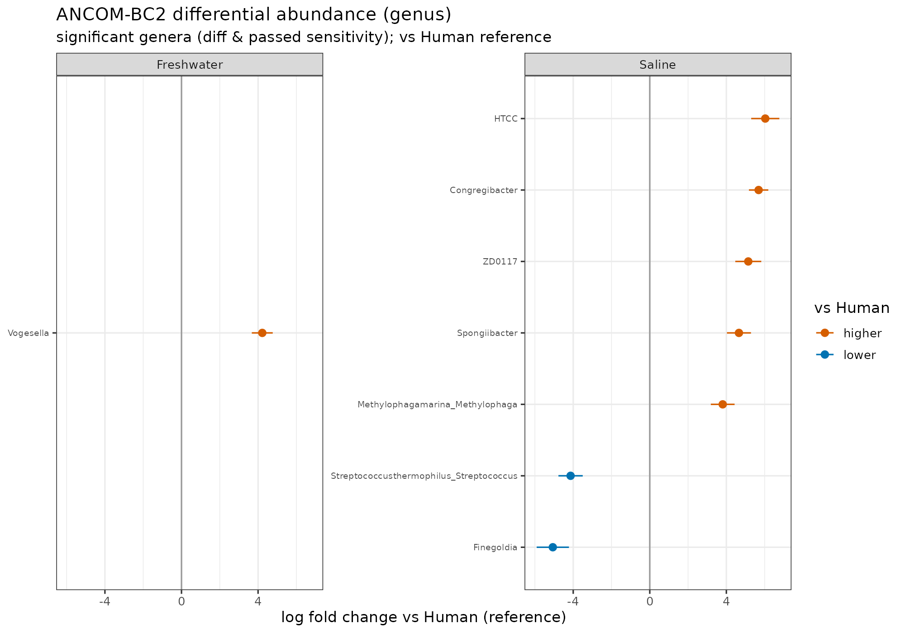

*Expected output. Genera passing both the difference test and the sensitivity analysis, by log fold change versus the reference group. In the example 8 genera are significant — marine taxa higher in Saline, human commensals lower — with points to the right meaning more abundant.*

### **Differential Abundance with MaAsLin2**

MaAsLin2 fits a generalised linear model to each taxon, applying TSS normalisation and LOG transformation by default.

Run it alongside ANCOM-BC2 because:

- It supports **random effects**, essential for repeated-measures, paired, or nested designs. (ANCOM-BC2 also supports them via `rand_formula`, but MaAsLin2's implementation is more established.)
- It handles **continuous covariates** naturally (body weight, temperature, age).
- It produces **per-association plots** automatically.

Different methods make different assumptions and can give different results. Nearing et al. (*Nat Commun* 2022) compared 14 DA methods across 38 datasets and found no single method was universally best. Reporting the consensus of two methods is more robust.

```r
library(Maaslin2)

# MaAsLin2 needs features (taxa) as COLUMNS, samples as ROWS — and it must test
# the SAME taxonomic rank as ANCOM-BC2, or the two result lists cannot be
# compared and "consensus" means nothing. ANCOM-BC2 above used
# tax_level = "genus", so aggregate to genus here.
ps_genus <- tax_glom(ps_raw, taxrank = "genus", NArm = FALSE)
taxa_names(ps_genus) <- make.unique(as.character(tax_table(ps_genus)[, "genus"]))

maaslin_counts <- as.data.frame(t(as(otu_table(ps_genus), "matrix")))
maaslin_meta   <- as.data.frame(as(sample_data(ps_genus), "data.frame"))

da_maaslin <- Maaslin2(
    input_data      = maaslin_counts,
    input_metadata  = maaslin_meta,
    output          = "maaslin2_output",
    transform       = "LOG",
    fixed_effects   = c("Site", "Sex"),
    # random_effects  = c("Individual"),   # uncomment for repeated measures
    normalization   = "TSS",
    standardize     = FALSE,
    min_prevalence  = 0.10,
    reference       = c("Site,Takapourewa")
)

# MaAsLin2's significant_results.tsv uses q < 0.25 by default; filter tighter here
sig_maaslin <- da_maaslin$results %>%
  filter(qval < 0.05)
head(sig_maaslin)
```

If you change `tax_level` in the ANCOM-BC2 call, change `taxrank` here to match. Running the two methods at different ranks is the easiest way to manufacture a false disagreement between them: a genus list and a species list share no feature names, so the intersection is empty for reasons that have nothing to do with the biology.

**Taking the consensus.** A taxon is a consensus hit when both methods call it significant at their own thresholds **and** agree on the direction of change. A taxon found by one method only is a candidate, not a finding — report it as such, in supplementary material.

```r
# Both methods must have been run at the same taxonomic rank for this to work.
ancom_hits <- da_ancom$res %>%
    filter(diff_SiteZealandia, passed_ss_SiteZealandia) %>%
    transmute(feature = taxon, ancom_lfc = lfc_SiteZealandia)

maaslin_hits <- da_maaslin$results %>%
    filter(metadata == "Site", value == "Zealandia", qval < 0.05) %>%
    transmute(feature, maaslin_coef = coef)

consensus <- inner_join(ancom_hits, maaslin_hits, by = "feature") %>%
    filter(sign(ancom_lfc) == sign(maaslin_coef))

cat("ANCOM-BC2:", nrow(ancom_hits), "| MaAsLin2:", nrow(maaslin_hits),
    "| consensus:", nrow(consensus), "\n")
consensus
```

If the join returns zero rows, compare `head(ancom_hits$feature)` with `head(maaslin_hits$feature)` before believing it: MaAsLin2 rewrites feature names containing spaces or punctuation, substituting dots, so the names may need harmonising first.

Parameters:

- `transform = "LOG"` (default) stabilises variance. Other options: `"AST"` (arcsine sqrt), `"LOGIT"`, `"NONE"`.
- `normalization = "TSS"` (default). Other options: `"CSS"`, `"CLR"`, `"NONE"`.
- `reference = c("Site,Takapourewa")` sets the reference level.
- `min_prevalence = 0.10` removes taxa in fewer than 10% of samples.

The output folder contains `all_results.tsv` (every association), `significant_results.tsv` (q < 0.25 by default), per-association plots in `figures/`, and a summary heatmap. Key columns: `feature`, `metadata`, `value`, `coef` (direction and magnitude), `stderr`, `pval`, `qval`.

**An optional third method.** If ANCOM-BC2 and MaAsLin2 disagree, ALDEx2 is a useful tie-breaker — same pattern, `ps_raw` in, CLR applied internally via Monte Carlo sampling from a Dirichlet posterior. Reporting the consensus of all three is the most defensible result, but two is the default.

## **11. Indicator Species**

While differential abundance asks "is this taxon more or less abundant in group A vs B?", indicator species analysis asks "which taxa are most diagnostic of each group?"

A good indicator has two properties:

1. **Specificity (A):** found mainly in one group. If 90% of *Campylobacter* reads come from mainland samples, it has high specificity for the mainland.
2. **Fidelity (B):** found consistently across samples within that group. If *Campylobacter* is in 8 of 10 mainland samples, it has high fidelity.

The **IndVal index** = √(A × B). A taxon found exclusively in one group (A = 1.0) and in every sample of it (B = 1.0) is a perfect indicator (IndVal = 1.0). Perfect indicators are rare; values above 0.5 are strong. The concept comes from ecology (Dufrêne & Legendre, 1997).

A taxon can be differentially abundant without being a good indicator (e.g. slightly more abundant in one group but present everywhere). An indicator really characterises a group, making it a candidate biomarker.

```r
library(indicspecies)

# Taxa as columns, samples as rows
abund_indic <- as.data.frame(t(counts_srs))

# Take the grouping from the phyloseq object, not from `metadata`. The object
# carries its own sample table, so this cannot drift out of step with the
# abundance matrix the way a separate data frame can.
groups      <- as.character(sample_data(ps_srs)$Site)

indval <- multipatt(abund_indic, groups,
                    func    = "IndVal.g",          # group-size corrected
                    control = how(nperm = 9999))

summary(indval)
```

The summary lists taxa significantly associated with each group (or combination of groups). For each: the associated group, `stat` (the IndVal statistic, higher = stronger), and `p.value` from the permutation test. Some taxa indicate a combination of groups (e.g. "Zealandia + YoungNicksHead"), distinguishing mainland from island sites but not the two mainland sites from each other.

`multipatt` does not correct for multiple testing internally, so apply FDR correction:

```r
# Correct across EVERY taxon tested, not just the ones that already passed
# p < 0.05 — filtering before adjusting shrinks the number of tests BH divides
# by and inflates the number of "significant" indicators several-fold.
ind_res             <- indval$sign
ind_res$p.adjusted  <- p.adjust(ind_res$p.value, method = "fdr")

sig_indicators_fdr  <- ind_res[!is.na(ind_res$p.adjusted) &
                               ind_res$p.adjusted < 0.05, ]
cat("Taxa tested:", sum(!is.na(ind_res$p.value)),
    "| raw p < 0.05:", sum(ind_res$p.value < 0.05, na.rm = TRUE),
    "| FDR < 0.05:", nrow(sig_indicators_fdr), "\n")
print(sig_indicators_fdr)
```

Correcting on the filtered subset is the more tempting of the two, because the code is shorter and the result looks better. It is wrong in one direction only: it always reports more indicators than are defensible.

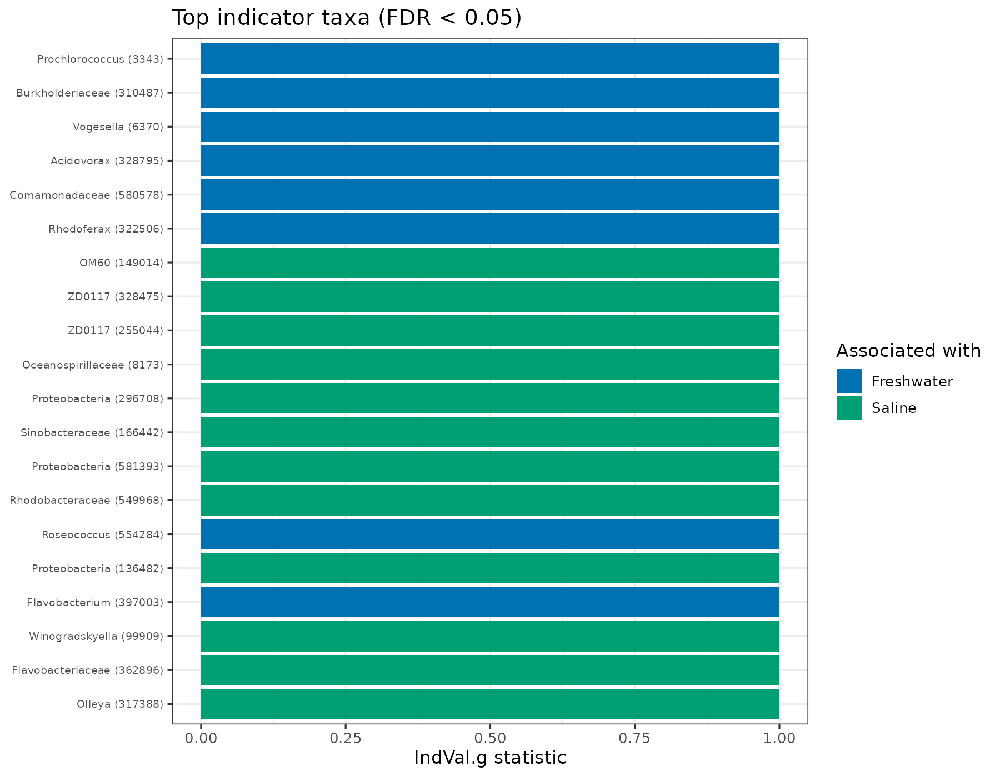

*Expected output. The strongest indicator taxa (IndVal.g, FDR < 0.05), coloured by the group they characterise. In the example 1,399 of 4,081 taxa pass FDR; a high IndVal combines being concentrated in a group and present across its samples.*

## **12. Co-occurrence Networks (optional)**

A **co-occurrence network** shows which taxa rise and fall together across samples. Nodes are taxa; an edge joins two that are associated — positively (they co-occur) or negatively (one tends to replace the other). It is a map of community structure, not of proven interactions.

**Do not build one by correlating relative abundances.** Because proportions sum to 1, one taxon rising forces the rest down, so Pearson or Spearman on proportions manufactures negative associations that are artefacts of the constraint rather than biology.

We use **SPIEC-EASI** (Kurtz et al. 2015) instead. It CLR-transforms the counts first — the same compositional fix as Aitchison distance — then infers a *conditional* dependency graph: an edge means two taxa are associated after accounting for every other taxon, rather than by a head-to-head correlation. It picks the network's sparsity by StARS stability selection instead of an arbitrary threshold, so the result is reproducible.

This step is optional and needs four extra packages from Section 2 — `igraph`, `ggraph`, `tidygraph`, and the GitHub-only `SpiecEasi`. Work at genus level and keep the most prevalent genera: stable inference needs more samples than taxa, so a smaller, readable set is both faster and sounder.

```r
library(SpiecEasi); library(igraph); library(ggraph); library(tidygraph)
set.seed(42)

# Genus level; keep the most prevalent genera for a tractable, stable network.
ps_g <- tax_glom(ps_raw, taxrank = "genus", NArm = TRUE)
taxa_names(ps_g) <- make.unique(as.character(tax_table(ps_g)[, "genus"]))
prev <- rowSums(as(otu_table(ps_g), "matrix") > 0)
keep <- names(sort(prev, decreasing = TRUE))[seq_len(min(50, ntaxa(ps_g)))]
ps_net <- prune_taxa(keep, ps_g)

# samples x taxa. Give SPIEC-EASI counts, not proportions — it CLR's internally.
otu <- t(as(otu_table(ps_net), "matrix"))
se  <- spiec.easi(otu, method = "mb", lambda.min.ratio = 1e-2, nlambda = 20,
                  pulsar.params = list(rep.num = 20, seed = 42))

# Fitted associations -> weighted, undirected graph; drop isolated nodes.
beta <- as.matrix(SpiecEasi::symBeta(SpiecEasi::getOptBeta(se), mode = "maxabs"))
rownames(beta) <- colnames(beta) <- colnames(otu)
g <- graph_from_adjacency_matrix(beta, mode = "undirected", weighted = TRUE, diag = FALSE)
g <- delete_vertices(g, igraph::degree(g) == 0)
```

**How long.** SPIEC-EASI refits the model many times for stability selection (`rep.num = 20`), so after the Bioconductor install it is the slowest step here — a few minutes on 50 taxa × 20 samples, and longer as either grows.

Confirm the network is not empty before plotting:

```r
npos <- sum(E(g)$weight > 0); nneg <- sum(E(g)$weight < 0)
cat(sprintf("nodes %d, edges %d (%d+/%d-), density %.3f\n",
            vcount(g), ecount(g), npos, nneg, edge_density(g)))
```

> **Expect** a connected network — on the example data, **50 nodes and 68 edges (63 positive, 5 negative), density 0.056**. **Zero edges** means the sparsity penalty is too high or you have too few samples: lower `lambda.min.ratio`, or gather more samples before trusting the structure.

Plot it, colouring edges by sign and sizing nodes by degree — the number of associations a taxon has, so high-degree "hub" taxa are the most connected:

```r
V(g)$deg    <- igraph::degree(g)
E(g)$sign   <- ifelse(E(g)$weight > 0, "positive", "negative")
E(g)$weight <- abs(E(g)$weight)                 # layout needs positive edge strengths

ggraph(as_tbl_graph(g), layout = "fr") +
  geom_edge_link(aes(colour = sign), width = 0.4, alpha = 0.6) +
  geom_node_point(aes(size = deg), shape = 21, fill = "grey70", colour = "grey20") +
  scale_edge_colour_manual(values = c(positive = "#0072B2", negative = "#D55E00")) +
  labs(edge_colour = "Association", size = "Degree") +
  theme_void()
```

The saved figure below additionally colours nodes by phylum and labels the hub genera; that styling is in `examples/r_analysis/run_example.R`.

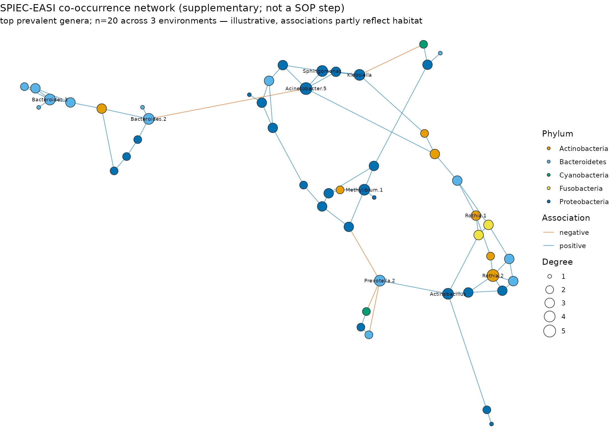

*Expected output. The 50 most prevalent genera, coloured by phylum and sized by degree; edges are SPIEC-EASI associations (blue positive, orange negative) with the ten hubs labelled. Read it as which taxa move together, not as proof of interaction — with n = 20 spanning three environments, many edges partly reflect shared habitat rather than direct ecology.*

## **13. Figures and Reproducibility**

### **Figures**

A typical 16S paper includes:

1. Rarefaction curves (adequate sampling depth)
2. Alpha diversity boxplots (Observed and/or Shannon) with significance brackets
3. PCoA ordination plots (Bray-Curtis and Aitchison) with ellipses and % variance labels
4. Betadisper centroid plots (supplementary, especially when betadisper p < 0.05)
5. Taxonomy barplots (phylum and/or genus level)
6. Differential abundance results (volcano plot, forest plot, or table of significant taxa)

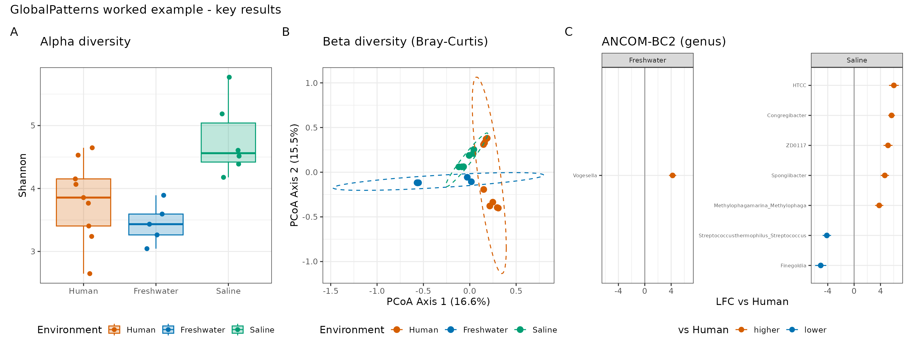

*Expected output. A composite of the key panels — alpha diversity, the Bray-Curtis ordination, and the ANCOM-BC2 effect sizes — assembled with `patchwork` as a starting point for a thesis figure.*

### **Reproducibility**

Record your software versions at the end of every analysis:

```r
sessionInfo()
```

Keep this output alongside your results. For longer-term reproducibility, use `renv::snapshot()` to lock package versions.

## **Troubleshooting and Common Pitfalls**

**Pseudoreplication.** The most common analytical error in host-microbiota studies: treating non-independent samples as independent (multiple swabs from one animal, co-housed mice that share microbes, technical replicates counted as biological). Identify your true experimental unit and either analyse at that level or use a mixed model with the grouping variable as a random effect.

**Confounding batch with treatment.** If all treated samples were extracted on Monday and all controls on Tuesday, you cannot separate treatment from extraction-day effects. Randomise processing across batches and include batch as a covariate. If batch is already confounded, acknowledge it as a limitation.

**Mixing up `ps_raw` and `ps_srs`.** Use `ps_raw` for differential abundance and Aitchison distance; use `ps_srs` for alpha diversity and Bray-Curtis. Mixing them produces wrong answers with no error message.

**Pre-normalising before DA tools.** ANCOM-BC2, MaAsLin2, and ALDEx2 expect raw counts and normalise internally. Applying SRS, CLR, or TSS first breaks their models. The normalised `ps_srs` is for alpha and beta diversity only.

**Reporting only one DA method.** Methods can disagree on the same data. Run two (or three) and report the consensus.

**No negative or positive controls.** Without extraction blanks you cannot identify contaminants; without a mock community you cannot assess classification accuracy.

**Choosing rarefaction depth after seeing results.** Decide normalisation depth from the rarefaction curves before looking at diversity results. Choosing the depth that makes a result significant is p-hacking.

**Ignoring dispersion in PERMANOVA.** A significant PERMANOVA with a significant betadisper may reflect differing variability rather than composition. Report both and visualise dispersion with the centroid plot.

**Over-claiming species-level identifications.** Even with full-length 16S and SUP basecalling, some closely related species cannot be reliably distinguished (the *Bacillus cereus* group, *E. coli*/*Shigella*, *Streptococcus mitis*/*pneumoniae*). Treat species-level calls as hypotheses unless validated.

**Confusing association with causation.** Observational studies show correlations. Default to "associated with" rather than "drives" or "causes" unless you have experimental evidence (gnotobiotic colonisation, FMT).

**Technical vs biological replicates.** A technical replicate measures pipeline noise; a biological replicate captures biological variation. Your n is the number of biological replicates. Five animals sequenced in triplicate is n = 5, not 15. Pool technical replicates (combine reads) or average them (compute the metric per replicate, then mean per biological sample).

**Simpson's paradox.** A trend within subgroups can reverse when subgroups are pooled. Always check whether your main result holds within each level of potential confounders, and include confounders in your model (`~ Site + Sex`, not `~ Sex` alone).

**The ecological fallacy.** Group-level correlations need not apply to individuals. Higher average *Akkermansia* in healthy populations does not mean a high-*Akkermansia* individual is less likely to be sick. Be explicit about whether your unit of inference is the individual, the group, or the sample.

**Independence matters more than sample size.** Ten truly independent replicates give more power than 50 pseudoreplicated measurements from 5 animals. For non-independent data (repeated measures, co-housed animals, nested designs), use mixed models, not more samples from the same limited pool.

## **Appendices**

### **Appendix A: References**

The primary literature behind the method choices in this document. Record your own package versions with `sessionInfo()` and cite the tools you actually ran (`citation("phyloseq")` and equivalents).

| Topic | Reference |
| --- | --- |
| Rarefaction debate (against) | McMurdie & Holmes 2014, *PLoS Computational Biology* 10(4):e1003531 |
| Rarefaction re-evaluated (for) | Schloss 2024, *mSphere* 9(1):e00355-23, and the companion 9(2):e00354-23 |
| DA-method benchmarking | Nearing et al. 2022, *Nature Communications* 13:342 |
| Indicator species / IndVal | Dufrêne & Legendre 1997, *Ecological Monographs* 67(3):345-366 |
| Co-occurrence networks (SPIEC-EASI) | Kurtz et al. 2015, *PLoS Computational Biology* 11(5):e1004226 |

### **Appendix B: Normalisation Methods**

SRS is the primary method (Section 6). The rest are here for reference; the workflow uses SRS plus internal rCLR and touches the others only through the tools that apply them.

**CLR (Centred Log-Ratio)** divides each count by the sample's geometric mean, then takes the log. This removes the compositional constraint and moves data into a space where Euclidean distance is appropriate; it is what makes Aitchison distance work. CLR is not appropriate for alpha diversity, and it is sensitive to zeros (you cannot log zero), which is why we use the robust CLR (rCLR) variant that skips zeros.

**TSS (Total Sum Scaling)** divides each count by the sample total to get proportions. Fine for taxonomy barplots and as input to some DA tools, but on its own it does not correct for compositional bias.

**CSS (Cumulative Sum Scaling)** is a quantile-based normalisation from metagenomeSeq, more robust than simple TSS. Available as a normalisation option in MaAsLin2.

### **Appendix C: Thresholds and Resource Figures**

The numbers used across the walkthrough, in one place. Each is a default with a reason; change it only with a reason of your own.

| Threshold | Value | Where | Why |
| --- | --- | --- | --- |
| Depth floor | 1,000 reads | Section 6 | Below this, richness is dominated by sampling effort, not biology. Treat < 10,000 with caution. |
| Cmin (SRS target) | shallowest sample's total | Section 6 | Every sample is scaled to this depth; if < ~1,000, drop that sample and recalculate. |
| `prv_cut` (prevalence filter) | 0.10 | Section 10 | Removes taxa in fewer than 10% of samples — they lack power and add noise. |
| `lib_cut` (ANCOM-BC2) | 1,000 reads | Section 10 | Drops samples below the depth floor before testing. |
| `neg_lb` ≥30 rule | 30 samples/group | Section 10 | Below this the structural-zero lower bound is unstable; keep `neg_lb = FALSE`. |
| NMDS stress | < 0.05 excellent, < 0.1 good, < 0.2 acceptable, > 0.2 unreliable | Section 8 | How faithfully the 2D plot preserves the true distances. |
| IndVal strength | > 0.5 strong (max 1.0) | Section 11 | Perfect indicators are rare; treat 0.5 as the practical bar. |
